# 🎫 HỆ THỐNG QUẢN LÝ HỖ TRỢ KỸ THUẬT (HELPDESK ITSM SYSTEM)

Dự án xây dựng hệ thống Helpdesk & Quản lý Dịch vụ Công nghệ Thông tin (ITSM) doanh nghiệp hiện đại, đa kênh (Omnichannel), hỗ trợ Multi-tenancy, Quản lý cam kết dịch vụ (SLA Engine), Điều phối phân công tự động (Assignment Rules), Cổng thông tin khách hàng (Customer Portal), Cơ sở tri thức (Knowledge Base), Đánh giá chất lượng dịch vụ (CSAT), Trung tâm thông báo thời gian thực và **Tích hợp Bot Discord tương tác 2 chiều (Interactive Bot Gateway & Slash Commands)** dựa trên nền tảng **ABP Framework v10.6**, **.NET 10**, **PostgreSQL** và **Angular 19 (Standalone)**.

---

## 📑 MỤC LỤC

1. [Tổng Quan Kiến Trúc & Công Nghệ](#-tổng-quan-kiến-trúc--công-nghệ)
2. [Lộ Trình Triển Khai & Trạng Thái Hệ Thống](#-lộ-trình-triển-khai--trạng-thái-hệ-thống)
3. [Bộ Sưu Tập Giao Diện Hệ Thống (UI Showcase)](#-bộ-sưu-tập-giao-diện-hệ-thống-ui-showcase)
4. [Mô Hình Cơ Sở Dữ Liệu & Mối Quan Hệ (Database Schema & ERD)](#-mô-hình-cơ-sở-dữ-liệu--mối-quan-hệ-database-schema--erd)
5. [Chi Tiết Các Phân Hệ & Tính Năng Đã Triển Khai](#-chi-tiết-các-phân-hệ--tính-năng-đã-triển-khai)
   - [Phân Hệ 1: Quản Lý Danh Mục Hệ Thống (Master Data)](#51-phân-hệ-1-quản-lý-danh-mục-hệ-thống-master-data)
   - [Phân Hệ 2: Quản Lý Sự Vụ Cốt Lõi (Ticket Lifecycle & Dual View)](#52-phân-hệ-2-quản-lý-sự-vụ-cốt-lõi-ticket-lifecycle--dual-view)
   - [Phân Hệ 3: Động Cơ Cam Kết Dịch Vụ (SLA Engine & Lịch Làm Việc)](#53-phân-hệ-3-động-cơ-cam-kết-dịch-vụ-sla-engine--lịch-làm-việc)
   - [Phân Hệ 4: Báo Cáo, Thống Kê & Giám Sát (Dashboard Analytics)](#54-phân-hệ-4-báo-cáo-thống-kê--giám-sát-dashboard-analytics)
   - [Phân Hệ 5: Quản Lý Tệp Đính Kèm Blob & Xuất Báo Cáo Excel (Gói Mở Rộng A)](#55-phân-hệ-5-quản-lý-tệp-đính-kèm-blob--xuất-báo-cáo-excel-gói-mở-rộng-a)
   - [Phân Hệ 6: Cơ Sở Tri Thức & Gợi Ý Giải Pháp (Knowledge Base & Deflection)](#56-phân-hệ-6-cơ-sở-tri-thức--gợi-ý-giải-pháp-knowledge-base--deflection)
   - [Phân Hệ 7: Cổng Khách Hàng & Đính Kèm Ảnh Lỗi (Customer Portal & Media Upload)](#57-phân-hệ-7-cổng-khách-hàng--đính-kèm-ảnh-lỗi-customer-portal--media-upload)
   - [Phân Hệ 8: Khảo Sát & Đo Lường Độ Hài Lòng Khách Hàng (CSAT Feedback)](#58-phân-hệ-8-khảo-sát--đo-lường-độ-hài-lòng-khách-hàng-csat-feedback)
   - [Phân Hệ 9: Cảnh Báo Discord Webhook Qua Background Jobs (Discord Alerts)](#59-phân-hệ-9-cảnh-báo-discord-webhook-qua-background-jobs-discord-alerts)
   - [Phân Hệ 10: Bot Trợ Lý Kỹ Thuật Viên & Tương Tác 2 Chiều Discord (Interactive Gateway Bot)](#510-phân-hệ-10-bot-trợ-lý-kỹ-thuật-viên--tương-tác-2-chiều-discord-interactive-gateway-bot)
   - [Phân Hệ 11: Điều Phối & Phân Công Tự Động (Auto-Assignment & Round Robin)](#511-phân-hệ-11-điều-phối--phân-công-tự-động-auto-assignment--round-robin)
   - [Phân Hệ 12: Trung Tâm Thông Báo Thời Gian Thực (In-App Notifications)](#512-phân-hệ-12-trung-tâm-thông-báo-thời-gian-thực-in-app-notifications)
   - [Phân Hệ 13: Hệ Thống Thông Báo Email HTML Tự Động (Responsive HTML Email Notifications)](#513-phân-hệ-13-hệ-thống-thông-báo-email-html-tự-động-responsive-html-email-notifications)
   - [Phân Hệ 14: Tự Động Hóa Quy Trình (Workflow Automation & Rules Engine)](#514-phân-hệ-14-tự-động-hóa-quy-trình-workflow-automation--rules-engine)
   - [Phân Hệ 15: Mẫu Thao Tác Nhanh 1-Click (Macros Engine)](#515-phân-hệ-15-mẫu-thao-tác-nhanh-1-click-macros-engine)
   - [Phân Hệ 16: Trợ Lý Trí Tuệ Nhân Tạo & Gợi Ý Thông Minh (AI Helpdesk Copilot & Smart Assistant)](#516-phân-hệ-16-trợ-lý-trí-tuệ-nhân-tạo--gợi-ý-thông-minh-ai-helpdesk-copilot--smart-assistant)
   - [Dữ Liệu Khởi Tạo Chuẩn (Data Seeding)](#517-dữ-liệu-khởi-tạo-chuẩn-data-seeding)
6. [Tài Khoản Mặc Định & Phân Quyền Vai Trò](#-tài-khoản-mặc-định--phân-quyền-vai-trò)
7. [Hướng Dẫn Cài Đặt, Migrate CSDL & Khởi Chạy](#-hướng-dẫn-cài-đặt-migrate-csdl--khởi-chạy)
8. [Tổng Hợp Các Lỗi Phát Sinh & Cách Khắc Phục (Troubleshooting Guide)](#-tổng-hợp-các-lỗi-phát-sinh--cách-khắc-phục-troubleshooting-guide)

---

## 🏛️ TỔNG QUAN KIẾN TRÚC & CÔNG NGHỆ

Hệ thống được thiết kế theo kiến trúc chuẩn **Domain-Driven Design (DDD)** của ABP Framework, đảm bảo tính mô-đun hóa cao, mở rộng linh hoạt:

| Tầng / Thành Phần | Công Nghệ & Thư Viện | Vai Trò & Điểm Nổi Bật |
|:---|:---|:---|
| **Backend Core** | **.NET 10.0**, **C# 13**, **ABP Framework v10.6.0** | Xử lý nghiệp vụ chuẩn DDD, Aggregate Roots, Domain Services, Event Bus, Background Workers & Background Jobs. |
| **Database & ORM** | **PostgreSQL 17** (Docker), **EF Core 10** | Quản lý dữ liệu quan hệ, Index tối ưu, Audit Logging, Concurrency Check, Code-First Migrations. |
| **Discord Gateway Bot** | **Discord.Net v3.18.0** | Bot WebSocket Gateway kết nối 2 chiều, lắng nghe Button Execution, Slash Command, Modal Form và Message events. |
| **Blob Storage** | **Volo.Abp.BlobStoring.Database** | Lưu trữ tập tin đính kèm và hình ảnh chụp lỗi trực tiếp trong PostgreSQL an toàn, đồng bộ giao dịch. |
| **Báo Cáo & Xuất Dữ Liệu**| **MiniExcel 1.46.0** | Thư viện stream Excel `.xlsx` hiệu năng cao, ngốn cực ít RAM, tốc độ xuất hàng chục ngàn dòng trong vài giây. |
| **Frontend Framework** | **Angular 19 (Standalone Components)** | Cấu trúc component độc lập, Signals & RxJS, Reactive Forms, Lazy-loading Routing, Type-safety cao. |
| **Giao Diện & UI/UX** | **Bootstrap 5**, **FontAwesome**, **Chart.js** | Giao diện hiện đại, Dashboard trực quan, Kanban board tương tác, Lightbox phóng to ảnh, Responsive. |
| **Bảo Mật & Phân Quyền**| **OpenIddict**, **JWT Bearer**, **RBAC** | Xác thực OAuth2/OIDC, phân quyền chi tiết (Permissions), tự động điều hướng trang chủ theo vai trò (Role Redirect). |

---

## 🗺️ LỘ TRÌNH TRIỂN KHAI & TRẠNG THÁI HỆ THỐNG

```
[Master Data] ──► [Ticket Core] ──► [SLA Engine] ──► [Dashboard KPI]
       │                 │                │                 │
       ▼                 ▼                ▼                 ▼
[Blob Attachments] ──► [MiniExcel] ──► [Knowledge Base] ──► [Customer Portal]
                                                                    │
                                                                    ▼
                                                            [CSAT Survey (5-Star)]
                                                                    │
                                                                    ▼
                                                [Discord Webhook Alerts (Level 2)]
                                                                    │
                                                                    ▼
                                                [Discord Interactive Bot Gateway]
                                                (Buttons, Modals & Slash Commands)
```

| STT | Phân Hệ / Gói Tính Năng | Chức Năng Cốt Lõi | Trạng Thái |
|:---:|:---|:---|:---:|
| **1** | **Quản Lý Danh Mục (Master Data)** | 6 danh mục: Categories, Priorities, Departments, Statuses, Sources, Canned Responses | **Hoàn thành 100%** |
| **2** | **Quản Lý Sự Vụ (Ticket Core)** | Vòng đời vé, sinh mã `TK-yyyyMMdd-XXXX`, Timeline, Dual View (Table & Kanban), Chuyển trạng thái, Phân công | **Hoàn thành 100%** |
| **3** | **Cam Kết Dịch Vụ (SLA Engine)** | Quy tắc SLA, Giờ làm việc hành chính & Ngày lễ, Phát hiện vi phạm hạn, Báo cáo tuân thủ | **Hoàn thành 100%** |
| **4** | **Báo Cáo & Thống Kê (Dashboard)** | Biểu đồ Chart.js, KPI số lượng, Hiệu suất nhân viên, Tỷ lệ tuân thủ SLA, Điểm CSAT, Tự động refresh | **Hoàn thành 100%** |
| **5** | **Gói Mở Rộng A (Tệp Đính Kèm & Excel)**| Lưu trữ Blob PostgreSQL, Xem trước ảnh Lightbox, Xuất file Excel MiniExcel, Bộ lọc khoảng ngày | **Hoàn thành 100%** |
| **6** | **Cơ Sở Tri Thức (Knowledge Base)** | Quản lý bài viết Markdown, Slug chuẩn URL, Đánh giá Hữu ích / Không hữu ích, Gợi ý khi tạo vé (Deflection) | **Hoàn thành 100%** |
| **7** | **Cổng Khách Hàng (Customer Portal)** | Giao diện tự phục vụ của khách hàng, tạo vé kèm ảnh lỗi (Dropzone), xem tiến độ, trao đổi phản hồi | **Hoàn thành 100%** |
| **8** | **Đo Lường Độ Hài Lòng (CSAT Survey)** | Đánh giá 5 sao & nhận xét sau khi vé giải quyết, thống kê CSAT Dashboard, Bảng xếp hạng hỗ trợ viên | **Hoàn thành 100%** |
| **9** | **Cảnh Báo Discord Webhook (Discord Alerts)** | Bắn Discord Embed Card tức thời qua Background Jobs (Vé mới, Khẩn cấp, Phân công, Vi phạm SLA, Hoàn tất) | **Hoàn thành 100%** |
| **10**| **Discord Interactive Bot (Gateway Bot)** | Nút bấm `[🎯 Nhận vé]`, `[🏁 Hoàn thành vé]` mở Modal, Lệnh `/create-ticket` mở Modal tạo vé, Discord Thread 2 chiều & Tự động lưu ảnh lỗi vào Web | **Hoàn thành 100%** |
| **11**| **Điều Phối Tự Động (Assignment Rules)** | Phân công thông minh theo Danh mục, Mức độ ưu tiên, Phòng ban; Thuật toán Round Robin xoay vòng | **Hoàn thành 100%** |
| **12**| **Thông Báo Thời Gian Thực (Notifications)** | Chuông thông báo góc trên web, đếm số chưa đọc, đánh dấu đã đọc, điều hướng trực tiếp tới vé | **Hoàn thành 100%** |
| **13**| **Thông Báo Email HTML Tự Động (Email Alerts)** | Tự động gửi Email thông báo (Tạo vé, Phân công kỹ thuật viên, Giải quyết vé + link CSAT 5 sao) mẫu HTML Responsive | **Hoàn thành 100%** |
| **14**| **Tự Động Hóa Quy Trình (Workflow Automation Engine)** | Tự động kích hoạt hành động theo 4 sự kiện (Created, Updated, Comment, Scheduled Time-based 48h), đánh giá đa điều kiện | **Hoàn thành 100%** |
| **15**| **Mẫu Thao Tác Nhanh 1-Click (Macros Engine)** | Kịch bản chuỗi hành động mẫu, áp dụng 1-click ngay trên giao diện vé (chèn phản hồi, đổi trạng thái, gán nhãn tức thời) | **Hoàn thành 100%** |
| **16**| **Trợ Lý Trí Tuệ Nhân Tạo (AI Helpdesk Copilot)** | Đa động cơ (Gemini, OpenAI, Ollama, Smart NLP), 1-Click tóm tắt sự vụ 3 phần, Smart Reply theo 4 phong cách + RAG Knowledge Base, phân tích tâm lý khách hàng | **Hoàn thành 100%** |

---

## 🖼️ BỘ SƯU TẬP GIAO DIỆN HỆ THỐNG (UI SHOWCASE)

Dưới đây là hình ảnh thực tế toàn bộ các phân hệ chính đang hoạt động trên hệ thống:

### 1. Bảng Điều Khiển Giám Sát Trung Tâm (Dashboard Analytics)
Màn hình giám sát 360 độ với các thẻ chỉ số trọng yếu (Total, Open, In Progress, Resolved, Overdue), tỷ lệ tuân thủ SLA, điểm CSAT trung bình, biểu đồ xu hướng Chart.js và bảng xếp hạng năng suất kỹ thuật viên:
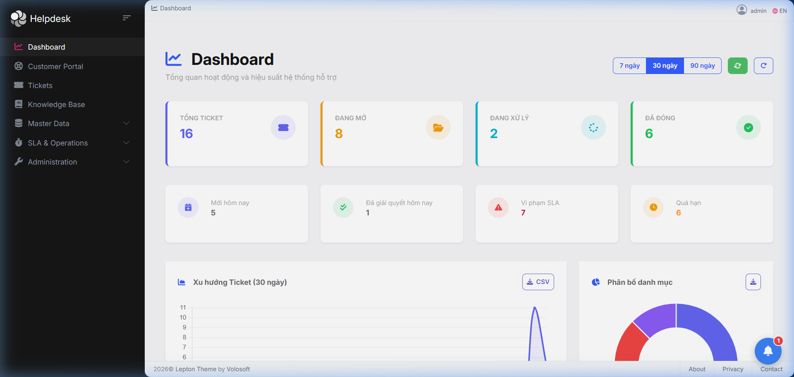

---

### 2. Quản Lý Sự Vụ - Dạng Bảng (Ticket Table View)
Giao diện quản lý danh sách sự vụ đa năng với hệ thống lọc đa tiêu chí (Trạng thái, Mức độ ưu tiên, Danh mục, Người phụ trách, Khoảng ngày), nhãn badge phân loại trực quan và nút xuất báo cáo Excel tốc độ cao:
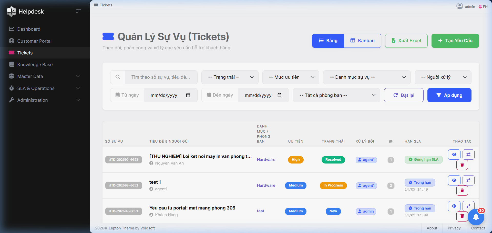

---

### 3. Quản Lý Sự Vụ - Bảng Kanban (Kanban Board View)
Chế độ xem bảng Kanban trực quan cho phép kỹ thuật viên nắm bắt nhanh chóng tiến độ các sự vụ theo từng cột trạng thái:
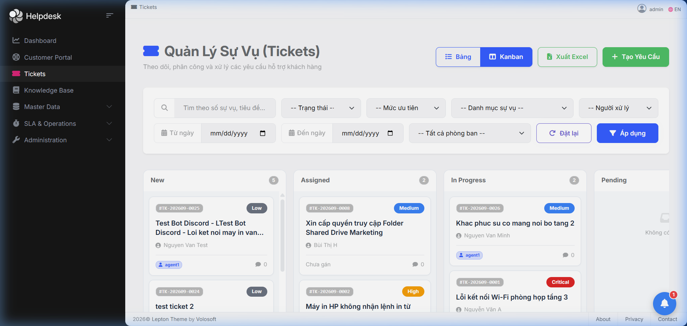

---

### 4. Hộp Thoại Tạo Yêu Cầu Hỗ Trợ Mới (Create Ticket Modal)
Modal tạo sự vụ nhanh với kiểm tra dữ liệu đầu vào (Validation), chọn mức độ ưu tiên, phân loại danh mục, ngày hết hạn SLA và tải lên nhiều tệp đính kèm:
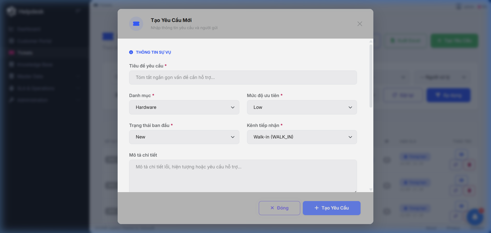

---

### 5. Chi Tiết Sự Vụ & Dòng Thời Gian Xử Lý (Ticket Detail & Timeline)
Màn hình chi tiết sự vụ toàn diện kết hợp luồng phản hồi khách hàng (Public Reply), ghi chú bảo mật nội bộ (Internal Note), nhật ký kiểm toán hệ thống (Audit Trail) và danh sách tệp đính kèm:
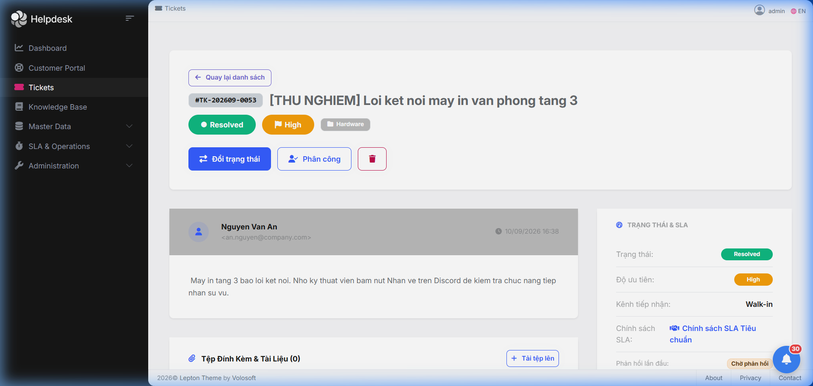

---

### 6. Quản Lý Chính Sách Cam Kết Dịch Vụ (SLA Policies)
Màn hình thiết lập chính sách SLA linh hoạt theo từng cặp Danh mục sự cố và Mức độ ưu tiên (thời gian phản hồi lần đầu & thời gian giải quyết cam kết):
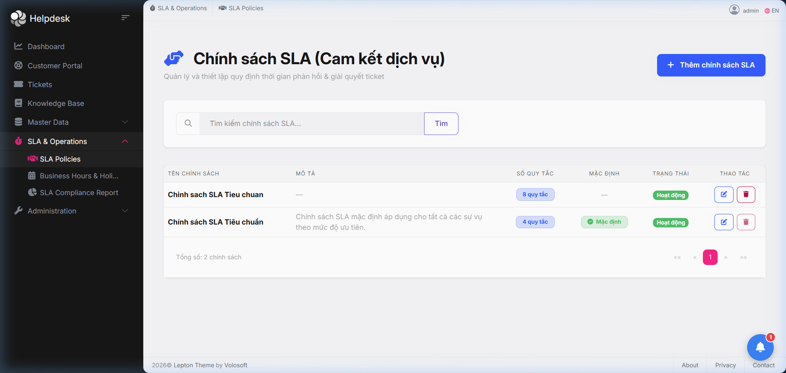

---

### 7. Báo Cáo Tuân Thủ SLA & Vi Phạm (SLA Compliance Report)
Báo cáo trực quan tỷ lệ phản hồi đúng hạn (%), tỷ lệ giải quyết đúng hạn (%) cùng danh sách chi tiết các vụ việc trễ hạn và nút xuất Excel kiểm toán:
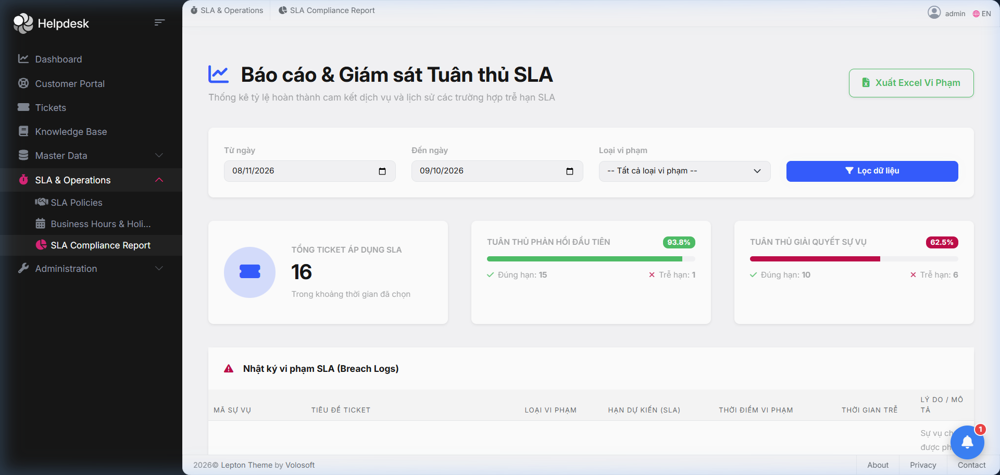

---

### 8. Quy Tắc Điều Phối Phân Công Tự Động (Auto-Assignment Rules)
Cấu hình quy tắc gán sự vụ thông minh theo thứ tự ưu tiên, kết hợp chiến lược xoay vòng công bằng **Round Robin** hoặc Least Busy:
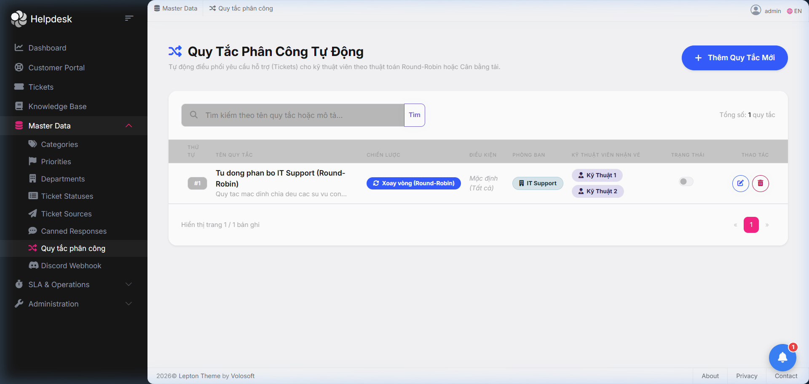

---

### 9. Cơ Sở Tri Thức & Tra Cứu Giải Pháp (Knowledge Base & Self-Service)
Thư viện bài viết hướng dẫn khắc phục sự cố văn phòng định dạng Markdown, phân mục khoa học, gắn tags và hỗ trợ bình chọn giải pháp hữu ích:
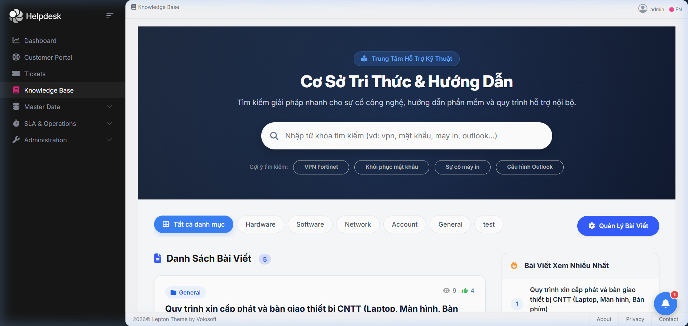

---

### 10. Quản Lý Danh Mục Sự Cố (Categories Management)
Giao diện quản lý danh mục phân cấp cha-con trực quan với mã code định danh, hỗ trợ tạo mới, chỉnh sửa và kích hoạt/vô hiệu hóa danh mục:
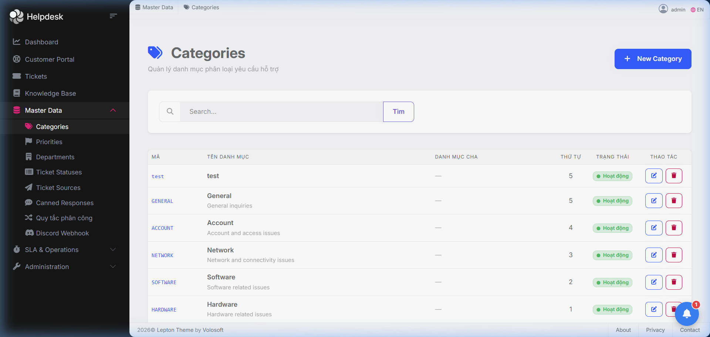

---

### 11. Cổng Người Dùng Cuối Tự Phục Vụ (Customer Portal)
Giao diện chuyên biệt dành cho khách hàng tự tạo yêu cầu hỗ trợ, kéo thả hình ảnh lỗi chụp màn hình và theo dõi tiến độ xử lý:
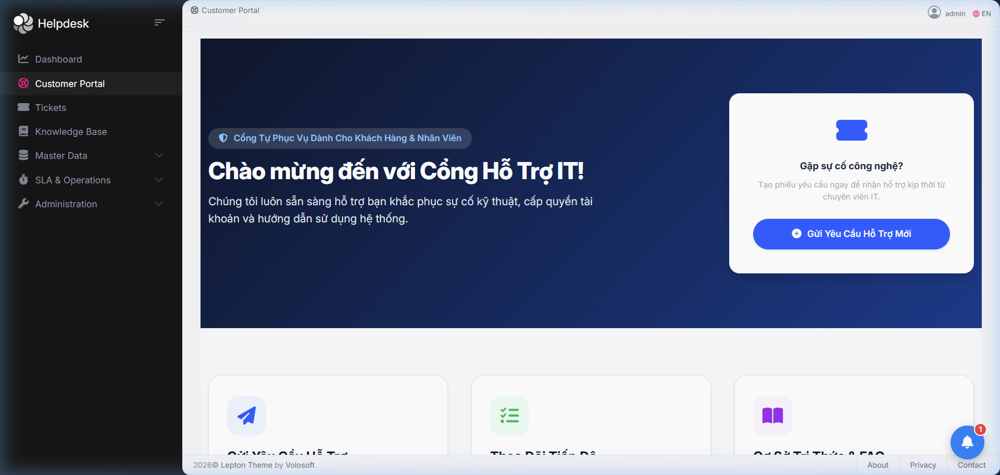

---

### 12. Cấu Hình Tích Hợp Discord (Discord Integration Settings)
Màn hình quản trị cho phép thiết lập linh hoạt Webhook URL, Bot Token, Kênh chỉ định (Channel ID) và bật/tắt từng loại cảnh báo:
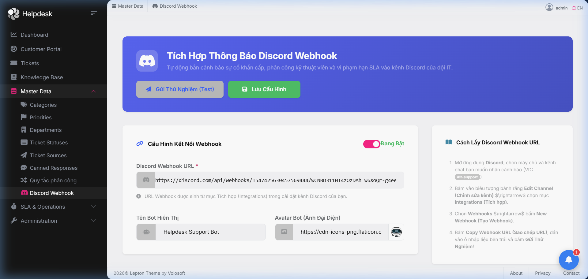

---

### 13. Tương Tác Hai Chiều Trên Discord (Discord Interactive Bot & Slash Commands)
Kỹ thuật viên thao tác trực tiếp trên Discord: Nhận vé bằng nút bấm, chuyển trạng thái vé, hoàn thành vé qua hộp thoại Modal, tra cứu danh sách vé bằng `/my-tickets` hoặc `!my-tickets`:
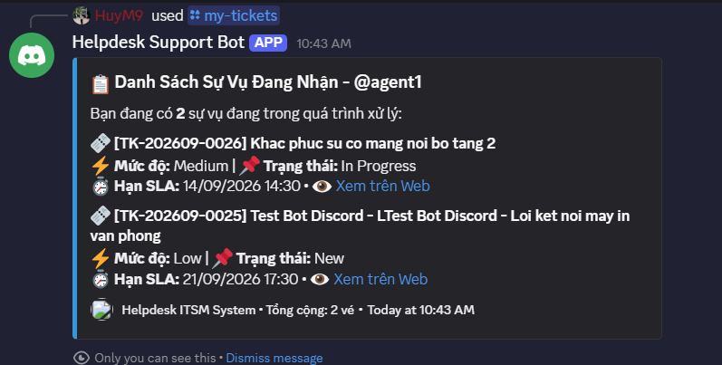

---

### 14. Tạo Sự Vụ Trực Tiếp Qua Lệnh Discord `/create-ticket` (Discord Create Ticket Modal)
Người dùng chỉ cần gõ `/create-ticket` trong máy chủ Discord để mở ngay Popup Modal chuẩn của Discord, điền tiêu đề, danh mục và mô tả sự cố. Hệ thống tự động tạo vé, tính SLA, kích hoạt Discord Thread thảo luận và lưu ảnh đính kèm:
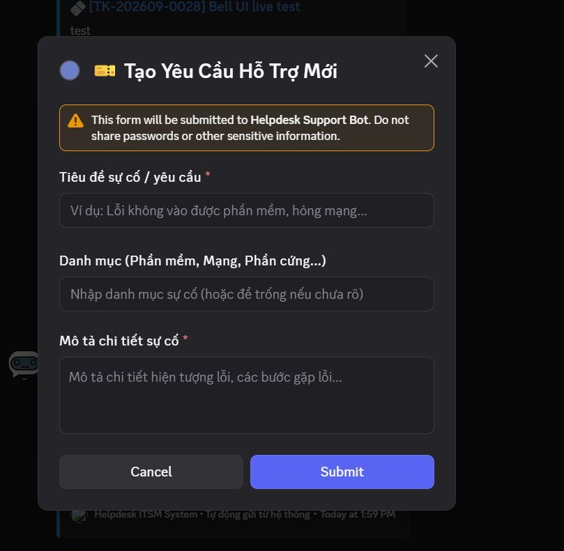

---

### 15. Quản Trị Quy Tắc Tự Động Hóa (Workflow Automation Rules)
Giao diện cấu hình linh hoạt các quy tắc "NẾU... THÌ..." tự động kích hoạt theo 4 sự kiện chính (Khi tạo vé mới, Khi cập nhật sự vụ, Khi có phản hồi mới, và Quét ngầm định kỳ Time-based). Cho phép lọc điều kiện theo từ khóa, mức độ ưu tiên, danh mục, trạng thái và tự động thực thi các hành động đồng loạt:
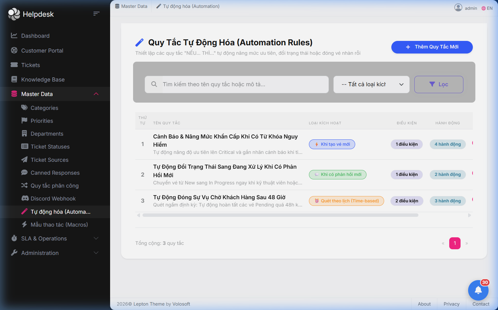

---

### 16. Quản Trị Mẫu Thao Tác Nhanh (Macros 1-Click Management)
Định nghĩa sẵn các kịch bản mẫu giúp kỹ thuật viên tiết kiệm thời gian xử lý các sự vụ lặp lại (ví dụ: *Hướng Dẫn Reset Mật Khẩu*, *Đã Hỗ Trợ Xong Qua UltraViewer/TeamViewer*). Mỗi Macro tích hợp chuỗi hành động chuẩn hóa: chèn nội dung phản hồi mẫu, đổi trạng thái vé, gán thẻ phân loại:
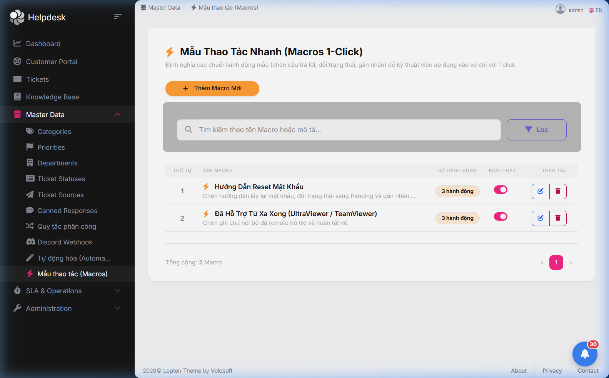

---

### 17. Áp Dụng Macro Nhanh 1-Click Trên Giao Diện Chi Tiết Sự Vụ (Ticket Detail Macro Execution)
Kỹ thuật viên thao tác trực tiếp trên trang chi tiết sự vụ: Nhấp nút **⚡ Áp Dụng Macro** để mở danh sách Macro khả dụng, xác nhận áp dụng để toàn bộ chuỗi hành động tự động thực thi ngay lập tức trong 1 giây (đổi trạng thái, gán thẻ, chèn câu trả lời và ghi nhật ký hoạt động vào Timeline):
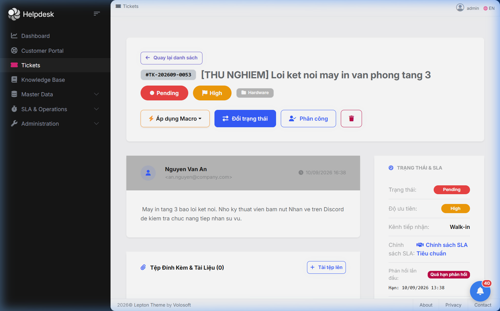

---

### 18. Cấu Hình AI Copilot & Đa Động Cơ Trí Tuệ Nhân Tạo (AI Copilot & Multi-Provider Settings)
Màn hình quản trị trung tâm của Trợ lý AI: Lựa chọn linh hoạt giữa 4 động cơ AI hàng đầu (Built-in Smart NLP, Google Gemini, OpenAI, Local Ollama), quản lý khóa bảo mật API Key mã hóa, tinh chỉnh nhiệt độ sáng tạo (Temperature), thiết lập chỉ đạo phong cách (Custom System Prompt) và nút bấm kiểm tra kết nối thời gian thực:
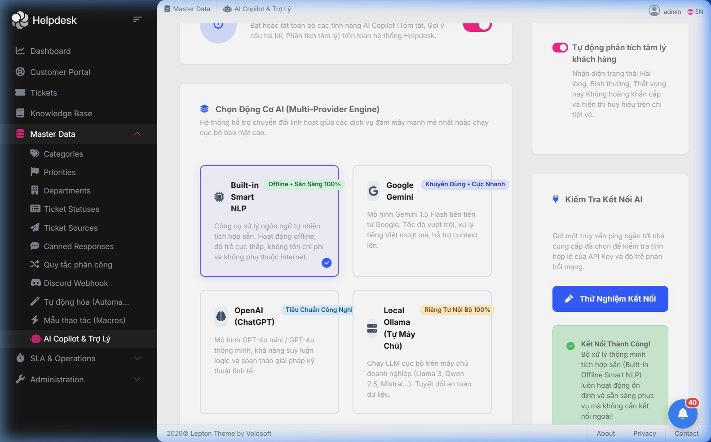

---

### 19. Trợ Lý AI Copilot & Soạn Thảo Phản Hồi Thông Minh Trên Chi Tiết Sự Vụ (Ticket AI Copilot & Smart Reply Drafter)
Kỹ thuật viên thao tác trực tiếp trên trang chi tiết sự vụ: Thẻ AI Copilot tự động phân tích tâm lý khách hàng (Customer Sentiment), tổng hợp 1-Click tóm tắt sự vụ chuẩn 3 mục (Vấn đề chính, Tiến trình đã làm, Bước tiếp theo), và hộp thoại Trợ lý soạn thảo phản hồi (Smart Reply Drafter) với 4 phong cách giọng văn, tự động truy xuất giải pháp từ Cẩm nang kỹ thuật (RAG Knowledge Base) và chèn thẳng vào khung soạn thảo:
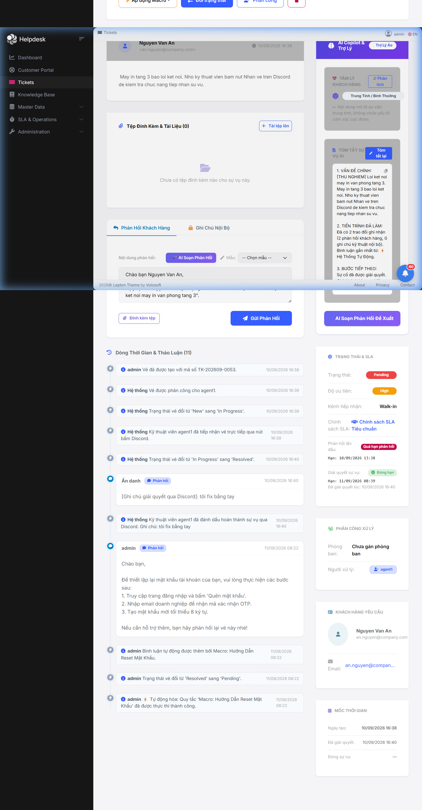

---

## 🗄️ MÔ HÌNH CƠ SỞ DỮ LIỆU & MỐI QUAN HỆ (DATABASE SCHEMA & ERD)

### 1. Sơ Đồ Thực Thể Quan Hệ (Entity Relationship Diagram - ERD)
*Sơ đồ chỉ tập trung hiển thị toàn bộ **21 bảng nghiệp vụ tùy biến** được xây dựng riêng cho dự án Helpdesk (loại trừ các bảng hệ thống mặc định của ABP Framework như `AbpUsers`, `AbpRoles`, `AbpSettings`...):*

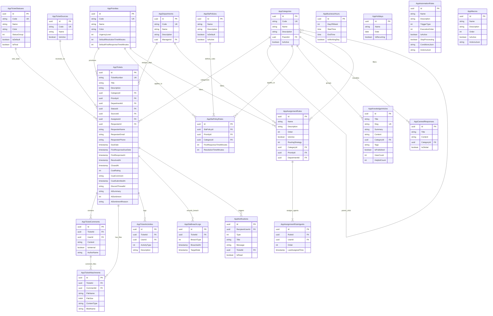

---

### 2. Danh Sách Các Bảng Dữ Liệu & Mô Tả Chi Tiết

#### 2.1. Nhóm Nghiệp Vụ Sự Vụ Cốt Lõi (Ticket Core)
| Tên Bảng | Mô Tả Chức Năng | Các Trường Chính & Khóa Ngoại |
|:---|:---|:---|
| **`AppTickets`** | Lưu trữ toàn bộ thông tin yêu cầu hỗ trợ (Aggregate Root). | `Id` (PK), `TicketNumber` (Unique), `Title`, `Description`, `CategoryId` (FK), `PriorityId` (FK), `DepartmentId` (FK), `StatusId` (FK), `SourceId` (FK), `AssigneeId` (FK $\rightarrow$ AbpUsers), `RequesterId` (FK $\rightarrow$ AbpUsers), `RequesterName`, `RequesterEmail`, `RequesterPhone`, `DueDate`, `FirstResponseDueDate`, `FirstResponseAt`, `ResolvedAt`, `ClosedAt`, `Tags`, `CsatRating`, `CsatComment`, `CsatSubmittedAt`. |
| **`AppTicketComments`** | Nội dung phản hồi và ghi chú nội bộ của sự vụ. | `Id` (PK), `TicketId` (FK $\rightarrow$ AppTickets), `UserId` (FK $\rightarrow$ AbpUsers), `Content`, `IsInternal` (phân biệt Public Reply vs Internal Note). |
| **`AppTicketAttachments`**| Thông tin siêu dữ liệu của tệp đính kèm và hình ảnh lỗi. | `Id` (PK), `TicketId` (FK $\rightarrow$ AppTickets), `CommentId` (FK $\rightarrow$ AppTicketComments), `FileName`, `FileSize`, `ContentType`, `BlobName` (khóa trỏ vào bảng lưu Blob). |
| **`AppTicketActivities`** | Lịch sử vết hoạt động (Audit Trail Timeline) của sự vụ. | `Id` (PK), `TicketId` (FK $\rightarrow$ AppTickets), `UserId` (FK $\rightarrow$ AbpUsers), `ActivityType` (Tạo, Đổi trạng thái, Phân công, Giải quyết, CSAT, Tự động hóa...), `Description`. |

#### 2.2. Nhóm Danh Mục Hệ Thống (Master Data)
| Tên Bảng | Mô Tả Chức Năng | Các Trường Chính & Khóa Ngoại |
|:---|:---|:---|
| **`AppCategories`** | Danh mục phân loại sự cố (hỗ trợ đa cấp cha-con). | `Id` (PK), `Code` (Unique), `Name`, `Description`, `ParentId` (FK self-referencing), `IsActive`. |
| **`AppPriorities`** | Mức độ ưu tiên (`Low`, `Medium`, `High`, `Critical`). | `Id` (PK), `Code` (Unique), `Name`, `Color` (Hex), `UrgencyLevel`, `DefaultResolutionTimeMinutes`, `DefaultFirstResponseTimeMinutes`. |
| **`AppTicketStatuses`**| Trạng thái vòng đời sự vụ. | `Id` (PK), `Code` (Unique), `Name`, `Color`, `StatusGroup` (`Open`, `InProgress`, `Closed`), `IsDefault`, `IsFinal`. |
| **`AppDepartments`** | Phòng ban hỗ trợ kỹ thuật. | `Id` (PK), `Code` (Unique), `Name`, `Description`, `ManagerId` (FK $\rightarrow$ AbpUsers). |
| **`AppTicketSources`** | Kênh phát sinh sự vụ (`Portal`, `Email`, `Phone`, `Chat`, `Walk-in`). | `Id` (PK), `Code` (Unique), `Name`, `IsActive`. |
| **`AppCannedResponses`**| Thư viện mẫu trả lời nhanh của kỹ thuật viên. | `Id` (PK), `Title`, `Content`, `CategoryId` (FK $\rightarrow$ AppCategories), `IsGlobal`. |

#### 2.3. Nhóm Cam Kết Dịch Vụ (SLA Engine)
| Tên Bảng | Mô Tả Chức Năng | Các Trường Chính & Khóa Ngoại |
|:---|:---|:---|
| **`AppSlaPolicies`** | Chính sách SLA tổng thể. | `Id` (PK), `Name`, `Description`, `IsDefault`, `IsActive`. |
| **`AppSlaPolicyRules`**| Quy tắc SLA chi tiết theo cặp Danh mục & Mức ưu tiên. | `Id` (PK), `SlaPolicyId` (FK $\rightarrow$ AppSlaPolicies), `PriorityId` (FK $\rightarrow$ AppPriorities), `CategoryId` (FK $\rightarrow$ AppCategories), `FirstResponseTimeMinutes`, `ResolutionTimeMinutes`. |
| **`AppBusinessHours`** | Cấu hình khung giờ làm việc hành chính trong tuần. | `Id` (PK), `DayOfWeek`, `StartTime`, `EndTime`, `IsWorkingDay`. |
| **`AppHolidays`** | Danh mục ngày nghỉ lễ tết (tự động loại trừ khỏi SLA).| `Id` (PK), `Name`, `Date`, `IsRecurring`. |
| **`AppSlaBreachLogs`** | Nhật ký các trường hợp vi phạm cam kết thời hạn SLA. | `Id` (PK), `TicketId` (FK $\rightarrow$ AppTickets), `BreachType` (Phản hồi trễ / Giải quyết trễ), `BreachedAt`, `TargetDate`. |

#### 2.4. Nhóm Điều Phối Tự Động & Cơ Sở Tri Thức
| Tên Bảng | Mô Tả Chức Năng | Các Trường Chính & Khóa Ngoại |
|:---|:---|:---|
| **`AppAssignmentRules`** | Quy tắc định tuyến sự vụ thông minh cho nhân viên. | `Id` (PK), `Name`, `Description`, `Order`, `IsActive`, `RoutingStrategy` (Round Robin / Least Busy / Manual), `CategoryId` (FK), `PriorityId` (FK), `DepartmentId` (FK). |
| **`AppAssignmentRuleAgents`**| Danh sách kỹ thuật viên tham gia trong quy tắc định tuyến. | `Id` (PK), `RuleId` (FK $\rightarrow$ AppAssignmentRules), `UserId` (FK $\rightarrow$ AbpUsers), `Order`, `LastAssignedTime`. |
| **`AppKnowledgeArticles`**| Bài viết hướng dẫn tự phục vụ (Knowledge Base). | `Id` (PK), `Title`, `Slug` (SEO URL), `Summary`, `Content` (Markdown), `CategoryId` (FK), `Tags`, `IsPublished`, `ViewCount`, `HelpfulCount`, `NotHelpfulCount`. |
| **`AppNotifications`** | Trung tâm thông báo nội bộ hệ thống. | `Id` (PK), `RecipientUserId` (FK $\rightarrow$ AbpUsers), `Type`, `Title`, `Message`, `TicketId` (FK $\rightarrow$ AppTickets), `IsRead`. |

#### 2.5. Nhóm Tự Động Hóa Quy Trình & Mẫu Thao Tác (Workflow Automation & Macros)
| Tên Bảng | Mô Tả Chức Năng | Các Trường Chính & Khóa Ngoại |
|:---|:---|:---|
| **`AppAutomationRules`** | Quy tắc tự động hóa "NẾU... THÌ..." xử lý sự vụ theo sự kiện hoặc quét định kỳ. | `Id` (PK), `Name`, `Description`, `TriggerType` (Tạo vé, Cập nhật, Phản hồi, Quét ngầm), `ExecutionOrder`, `IsActive`, `StopProcessing`, `ConditionsJson` (Danh sách điều kiện lọc), `ActionsJson` (Chuỗi hành động thực thi). |
| **`AppMacros`** | Mẫu kịch bản thao tác 1-Click dành cho kỹ thuật viên trên trang chi tiết sự vụ. | `Id` (PK), `Name`, `Description`, `Order`, `IsActive`, `ActionsJson` (Chuỗi hành động mẫu: chèn câu trả lời, đổi trạng thái, gắn thẻ...). |

---

## 🚀 CHI TIẾT CÁC PHÂN HỆ & TÍNH NĂNG ĐÃ TRIỂN KHAI

### 5.1. Phân Hệ 1: Quản Lý Danh Mục Hệ Thống (Master Data)
Cung cấp bộ danh mục cấu hình toàn diện cho toàn bộ quy trình tiếp nhận và phân loại hỗ trợ:
1. **Category (Danh mục sự cố)**: Hỗ trợ cấu trúc phân cấp cha-con, quản lý mã duy nhất, tên, mô tả.
2. **Priority (Mức độ ưu tiên)**: `Low`, `Medium`, `High`, `Critical`. Gắn mã màu nhận diện (Hex/Color code) và thời gian phản hồi/giải quyết SLA tiêu chuẩn.
3. **Department (Phòng ban hỗ trợ)**: Quản lý các đơn vị kỹ thuật (IT Support, Phần mềm, Mạng, Bảo hành...) và trưởng bộ phận.
4. **TicketStatus (Trạng thái vé)**: Nhóm trạng thái (`Open`, `InProgress`, `Closed`), đánh dấu trạng thái khởi tạo mặc định (`isDefault`) và trạng thái hoàn tất (`isFinal`).
5. **TicketSource (Kênh tiếp nhận)**: Kênh phát sinh (`Portal`, `Email`, `Phone`, `Chat`, `Walk-in`).
6. **CannedResponse (Mẫu phản hồi nhanh)**: Thư viện soạn sẵn mẫu trả lời thường gặp, gắn thẻ theo danh mục, phạm vi áp dụng công khai hoặc nội bộ.
- **Frontend Angular**: Bộ màn hình CRUD trực quan tại `/master-data/*` với thanh tìm kiếm, Modal Reactive Form, phân trang chuẩn và hộp thoại xác nhận xóa.

---

### 5.2. Phân Hệ 2: Quản Lý Sự Vụ Cốt Lõi (Ticket Lifecycle & Dual View)
Trung tâm điều phối và xử lý toàn bộ vòng đời của yêu cầu hỗ trợ:
- **Tự động sinh mã vé**: Domain Service `TicketManager` tự động sinh mã chuẩn `TK-yyyyMMdd-XXXX` (VD: `TK-20260908-0001`), chống trùng lặp tuyệt đối.
- **Chế độ xem linh hoạt (Dual View)**:
  - **Dạng Bảng (Table View)**: Đầy đủ cột dữ liệu nghiệp vụ, nhãn ưu tiên và trạng thái phối màu trực quan, phân trang, lọc đa tiêu chí (Trạng thái, Ưu tiên, Danh mục, Người xử lý, Khoảng ngày).
  - **Dạng Bảng Kanban (Kanban Board View)**: Nhóm thẻ vé theo từng cột trạng thái trực quan, hiển thị nhanh người yêu cầu, độ khẩn cấp, người phụ trách và số lượng trao đổi.
- **Chi Tiết Sự Vụ Toàn Diện (`/tickets/:id`)**:
  - **Phản hồi 2 chế độ**: *Phản Hồi Khách Hàng (Public Reply)* vs *Ghi Chú Kỹ Thuật Nội Bộ (Internal Note - dán nhãn vàng bảo mật)*.
  - Tích hợp chèn nhanh câu trả lời từ kho **Canned Responses**.
  - **Dòng thời gian (Timeline & Audit Trail)**: Kết hợp liên tục giữa nội dung trao đổi, ghi chú nội bộ và nhật ký kiểm toán hệ thống (đổi trạng thái, phân công, tải tệp, đánh giá CSAT).
  - Thao tác nhanh: Đổi trạng thái vé, chuyển giao người phụ trách (Assign), đóng vé.

---

### 5.3. Phân Hệ 3: Động Cơ Cam Kết Dịch Vụ (SLA Engine & Lịch Làm Việc)
Tự động hóa hoàn toàn việc giám sát và cảnh báo thời hạn xử lý:
- **Chính sách SLA linh hoạt (`SlaPolicy` & `SlaPolicyRule`)**: Thiết lập thời hạn phản hồi lần đầu (`FirstResponseTimeMinutes`) và giải quyết sự cố (`ResolutionTimeMinutes`) theo từng cặp Danh mục & Mức độ ưu tiên.
- **Khung giờ làm việc (`BusinessHour`) & Ngày lễ (`Holiday`)**: Tự động tính trừ thời gian ngoài giờ làm việc (mặc định Thứ 2 - Thứ 6, 08:30 - 17:30) và các ngày lễ tết được cấu hình trong bảng `AppHolidays`.
- **Bộ máy tính SLA (`SlaManager`)**: Tự động xác định chính xác `FirstResponseDueDate` và `DueDate` ngay khi vé được tạo.
- **Background Worker & Cảnh báo vi phạm**: Quét định kỳ phát hiện sự vụ quá hạn, ghi log vào bảng `AppSlaBreachLogs`.
- **Giao diện báo cáo tuân thủ (`/sla/compliance`)**: Tỷ lệ phản hồi đúng hạn (%), tỷ lệ giải quyết đúng hạn (%), danh sách vi phạm và xuất báo cáo Excel vi phạm SLA.

---

### 5.4. Phân Hệ 4: Báo Cáo, Thống Kê & Giám Sát (Dashboard Analytics)
Cung cấp cái nhìn 360 độ về hiệu suất vận hành của đội ngũ hỗ trợ:
- **Thẻ chỉ số trọng yếu (KPI Stat Cards)**: Tổng số vé, Vé đang mở, Đang xử lý, Đã giải quyết, Vé tạo mới trong ngày, Vé quá hạn (`Overdue`).
- **Chỉ số chất lượng dịch vụ**: Tỷ lệ tuân thủ phản hồi SLA (%), Tỷ lệ tuân thủ giải quyết SLA (%), Điểm hài lòng khách hàng trung bình (CSAT ⭐) và Tỷ lệ khách hàng hài lòng (%).
- **Biểu đồ trực quan (Chart.js)**:
  - *Biểu đồ xu hướng (Trend Chart)*: Khối lượng sự vụ tạo mới, giải quyết và đóng theo các mốc 7, 14, 30, 90 ngày.
  - *Biểu đồ cơ cấu danh mục (Category Distribution)*: Tỷ trọng % theo từng nhóm sự cố (Phần cứng, Phần mềm, Mạng, Tài khoản...).
- **Bảng xếp hạng hiệu suất nhân viên (Agent Performance Leaderboard)**: Số vé tiếp nhận, Số vé đã hoàn tất, Tỷ lệ tuân thủ SLA (%) và Điểm đánh giá CSAT trung bình của từng kỹ thuật viên.
- **Auto-Refresh**: Cơ chế tự động làm mới số liệu mỗi 30 giây giúp màn hình giám sát luôn cập nhật theo thời gian thực.

---

### 5.5. Phân Hệ 5: Quản Lý Tệp Đính Kèm Blob & Xuất Báo Cáo Excel (Gói Mở Rộng A)
- **Lưu trữ Blob trong PostgreSQL Database (`Volo.Abp.BlobStoring.Database`)**:
  - Lưu trữ tập tin đính kèm trực tiếp vào bảng cơ sở dữ liệu `AppTicketAttachments`, đảm bảo tính toàn vẹn dữ liệu, dễ sao lưu và không bị thất lạc file khi chuyển đổi môi trường server.
  - Hỗ trợ tải lên nhiều tệp cùng lúc tại màn hình tạo vé và trong khung phản hồi sự vụ.
  - Nhận diện icon theo định dạng file, hiển thị dung lượng tệp, xem trước hình ảnh lỗi phóng to (**Lightbox Modal**) và tải về an toàn.
- **Xuất Báo Cáo Excel Siêu Tốc với MiniExcel 1.46.0**:
  - Tích hợp thư viện stream Excel `.xlsx` chuyên dụng cho .NET 10.
  - **Xuất danh sách sự vụ**: Kèm đầy đủ thông tin mã vé, tiêu đề, trạng thái, mức ưu tiên, người yêu cầu, kỹ thuật viên, hạn SLA, áp dụng chính xác các bộ lọc đang chọn trên giao diện.
  - **Xuất báo cáo vi phạm SLA**: Trích xuất chi tiết các vụ việc trễ hạn cam kết.
- **Bộ lọc theo khoảng ngày (Date Range Filter)**: Cho phép lọc chính xác danh sách sự vụ phát sinh từ ngày đến ngày.

---

### 5.6. Phân Hệ 6: Cơ Sở Tri Thức & Gợi Ý Giải Pháp (Knowledge Base & Deflection)
Giảm tải khối lượng vé hỗ trợ bằng cổng tra cứu tự phục vụ:
- **Quản lý bài viết Knowledge Base**: Quản lý bài viết với tiêu đề, tóm tắt, nội dung định dạng Markdown, phân mục (`Category`), tags và trạng thái xuất bản (`IsPublished`).
- **Tự động sinh Slug chuẩn SEO**: Sinh URL thân thiện từ tiêu đề tiếng Việt không dấu (VD: `huong-dan-cai-dat-vpn-cong-ty`), tự động hậu tố chống trùng slug.
- **Cơ chế ngăn ngừa tạo vé (Ticket Deflection)**: Khi người dùng đang nhập tiêu đề sự cố tại cổng Portal, hệ thống tự động tìm kiếm và hiển thị danh sách bài viết liên quan kèm nút xem nhanh giải pháp, giúp người dùng tự khắc phục mà không cần gửi vé.
- **Đánh giá Hữu ích**: Người đọc bình chọn "Hữu ích" (👍) hoặc "Chưa hữu ích" (👎), tự động thống kê xếp hạng các bài viết phổ biến nhất (`popular-articles`).

---

### 5.7. Phân Hệ 7: Cổng Khách Hàng & Đính Kèm Ảnh Lỗi (Customer Portal & Media Upload)
Giao diện portal riêng biệt tối ưu hóa trải nghiệm người dùng cuối (`/portal`):
- **Giao diện tự phục vụ thân thiện**: Khách hàng theo dõi danh sách "Vé của tôi", lọc theo trạng thái (Đang xử lý / Đã đóng), tìm kiếm theo mã vé.
- **Tải tệp & Hình ảnh chụp lỗi trực quan (Attachment Dropzone)**:
  - Khách hàng có thể kéo thả hoặc chọn nhiều hình ảnh lỗi/chụp màn hình khi gửi yêu cầu hỗ trợ mới.
  - Hỗ trợ đính kèm tệp bổ sung trong khung gửi phản hồi (Reply).
  - Tích hợp xem trước dạng thumbnail và click để phóng to ảnh xem chi tiết lỗi.
- **API chuyên biệt & Bảo mật tuyệt đối**:
  - Cung cấp các endpoint riêng: `UploadMyAttachmentAsync`, `DownloadMyAttachmentAsync` trong `CustomerPortalAppService`.
  - Kiểm tra xác thực quyền sở hữu vé nghiêm ngặt (`CheckCustomerAccess`), chặn hoàn toàn hành vi truy cập hoặc tải tệp của vé người khác.
  - Ẩn hoàn toàn các ghi chú nội bộ (`IsInternal`) của kỹ thuật viên khỏi màn hình của khách hàng.

---

### 5.8. Phân Hệ 8: Khảo Sát & Đo Lường Độ Hài Lòng Khách Hàng (CSAT Feedback)
Đo lường trực tiếp chất lượng phục vụ của đội ngũ hỗ trợ kỹ thuật:
- **Cơ sở dữ liệu**: Bổ sung các trường `CsatRating` (1 - 5 sao), `CsatComment` (Nhận xét góp ý), `CsatSubmittedAt` (Thời gian đánh giá) vào bảng `AppTickets`.
- **Luồng đánh giá trên Customer Portal**:
  - Khi sự vụ chuyển sang trạng thái đã xử lý (`Resolved`) hoặc đã đóng (`Closed`), khung đánh giá CSAT 5 sao tương tác sẽ tự động xuất hiện nổi bật tại trang chi tiết `/portal/tickets/:id`.
  - Khách hàng chọn số sao (từ 1 sao "Rất không hài lòng" đến 5 sao "Rất tuyệt vời"), điền nhận xét và gửi đánh giá.
  - Sau khi gửi thành công, giao diện hiển thị thông báo cảm ơn trang trọng và khóa form để chống sửa đổi tùy tiện.
- **Hiển thị trên Quản trị & Chi tiết vé**:
  - Thẻ thông tin CSAT xuất hiện trên trang chi tiết sự vụ của kỹ thuật viên (`/tickets/:id`) hiển thị số sao vàng, nội dung nhận xét và thời gian khách hàng gửi đánh giá.
  - Huy hiệu số sao CSAT (VD: ⭐ 5/5) hiển thị trực tiếp trên danh sách vé của khách hàng.
- **Tích hợp Dashboard KPI**:
  - Thẻ KPI hiển thị Điểm CSAT trung bình và Tỷ lệ phản hồi hài lòng (%).
  - Cột CSAT trung bình được tích hợp trực tiếp vào Bảng xếp hạng hiệu suất nhân viên (Agent Performance Leaderboard).

---

### 5.9. Phân Hệ 9: Cảnh Báo Discord Webhook Qua Background Jobs (Discord Alerts)
Tự động hóa kênh liên lạc khẩn cấp trực tiếp vào Discord channel của đội IT Support:
- **Kiến trúc Bất đồng bộ hóa qua ABP Background Jobs (Cấp độ 2)**:
  - Tách rời hoàn toàn luồng gửi HTTP POST sang Discord khỏi luồng HTTP Request của người dùng bằng `IBackgroundJobManager` và `AsyncBackgroundJob<DiscordNotificationArgs>`.
  - Giảm thời gian phản hồi của API tạo và cập nhật vé từ ~1s xuống chỉ còn **~50ms** (gần như tức thì).
  - Tự động lưu job vào bảng `AbpBackgroundJobs` trên PostgreSQL và kích hoạt cơ chế **Auto-Retry (Exponential Backoff)** khi Discord bị Rate Limit (HTTP 429) hoặc lỗi mạng tạm thời.
- **Discord Webhook Rich Embeds**:
  - Gửi các thẻ thông tin **Discord Embed Card** nhiều màu sắc trực quan (Xanh dương cho vé mới, Vàng cam khi phân công, Đỏ cho sự cố Critical hoặc vi phạm hạn SLA, Xanh lá khi xử lý hoàn tất).
  - Cung cấp đầy đủ thông tin: Mã vé `TK-xxxx`, Tiêu đề, Người yêu cầu, Mức ưu tiên, Danh mục, Hạn chót SLA và nút mở xem trực tiếp trên web.
- **Cấu hình động đa tầng (Dynamic Setting Management)**:
  - Cho phép Quản trị viên thay đổi Webhook URL, Bật/Tắt các loại thông báo trực tiếp trên giao diện web `/discord-settings` mà không cần khởi động lại máy chủ.
  - Tích hợp nút kiểm tra kết nối tức thời (**Test Webhook**) với phản hồi trạng thái chi tiết.

---

### 5.10. Phân Hệ 10: Bot Trợ Lý Kỹ Thuật Viên & Tương Tác 2 Chiều Discord (Interactive Gateway Bot)
Nâng cấp từ thông báo 1 chiều thành nền tảng điều phối hỗ trợ 2 chiều hoàn chỉnh trực tiếp trên Discord:
- **Kết nối Gateway thời gian thực (`DiscordSocketClient` - Discord.Net v3.18)**:
  - Bot tự động duy trì kết nối WebSocket Gateway liên tục khi backend khởi động.
  - Đăng ký lắng nghe sự kiện: `Ready`, `ButtonExecuted`, `ModalSubmitted`, `SlashCommandExecuted`, `MessageReceived`.
- **Tạo sự vụ trực tiếp qua Slash Command `/create-ticket` với Discord Modal**:
  - Người dùng hoặc nhân viên chỉ cần gõ `/create-ticket` trong máy chủ Discord để mở ngay **Cửa sổ Popup (Discord Modal)** chuẩn.
  - Biểu mẫu gồm: **Tiêu đề sự cố / yêu cầu** (bắt buộc), **Danh mục** (tự động phân loại hoặc gợi ý), **Mô tả chi tiết sự cố** (bắt buộc).
  - Khi gửi form: Hệ thống tự động tạo vé vào PostgreSQL, kích hoạt SLA Engine tính hạn chót, kích hoạt Auto-Assignment, đồng thời phản hồi xác nhận riêng tư (ephemeral) kèm mã vé `TK-xxxx` và đường dẫn xem chi tiết trên Web.
- **Tự động kích hoạt Discord Thread (Luồng thảo luận) cho từng sự vụ**:
  - Mỗi khi có sự vụ mới tạo (từ Web hoặc Discord), Bot tự động tạo một **Discord Thread** riêng gắn liền với tin nhắn thông báo (VD: `[#TK-202609-0053] Lỗi kết nối...`).
  - Bot tự động tag người yêu cầu (`<@discordUserId>`) trong tin nhắn chào đón đầu tiên để luồng thảo luận xuất hiện ngay trên thanh điều hướng của người đó.
  - **Đồng bộ bình luận 2 chiều (Bidirectional Sync)**:
    - Bất kỳ ai nhắn tin trao đổi trong Thread -> Bot tự động bắt sự kiện `MessageReceived` và lưu thành bình luận (`TicketComment`) trên Web kèm tên tác giả `@[username] (Discord)` và thả cảm xúc `✅`.
    - Bất kỳ bình luận công khai nào trên giao diện Web -> Bot tự động chuyển tiếp vào Discord Thread.
- **Tự động Đồng bộ Hình ảnh & Tệp đính kèm từ Discord Thread lên Web (Media & Screenshot Sync)**:
  - Để khắc phục hạn chế của Discord Modal (không hỗ trợ component upload file trong modal), người dùng chỉ cần **chụp màn hình rồi nhấn `Ctrl + V`** (hoặc kéo thả ảnh/file) trực tiếp vào Discord Thread của sự vụ.
  - Bot tự động tải ảnh từ Discord CDN, lưu trữ an toàn vào **PostgreSQL Blob Storage** (`IBlobContainer`), tạo bản ghi `TicketAttachment` liên kết với bình luận và sự vụ.
  - Hình ảnh lập tức xuất hiện trong timeline trao đổi và mục "Tệp Đính Kèm & Tài Liệu" của Ticket trên Web (hỗ trợ Xem trước ảnh phóng to và Tải về).
  - Bot tự động thả biểu tượng `📎` và `✅` vào tin nhắn Discord để xác nhận tệp đã được đồng bộ an toàn lên Web.
- **Nút bấm tương tác trên tin nhắn vé (Interactive Buttons & Safe Lifecycle)**:
  - **Nút `[🎯 Nhận vé này]`**: Khi kỹ thuật viên bấm nút, bot tự động nhận diện tài khoản kỹ thuật viên, gán người phụ trách (`AssigneeId`), chuyển trạng thái vé sang **Đang xử lý (In Progress)**, gửi thông báo phân công vào Discord Thread, cập nhật tin nhắn gốc qua `Message.ModifyAsync` an toàn sang màu vàng cam và hiển thị nút **`[🏁 Hoàn thành vé]`**.
  - **Nút `[🏁 Hoàn thành vé]`**: Bấm nút sẽ bật ngay **Discord Popup Modal** yêu cầu nhập ghi chú / cách khắc phục sự cố. Khi gửi Modal, hệ thống tự động:
    - Đổi trạng thái vé sang **Đã giải quyết (Resolved)** và đóng lại.
    - Lưu ghi chú vào bảng `AppTicketComments`.
    - Ghi nhận hoạt động vào `AppTicketActivities`.
    - Đổi embed tin nhắn gốc sang màu **Xanh lá (Resolved)** và khóa các nút bấm.
- **Hệ thống Lệnh Slash Command (`/`) & Đăng ký Guild-level**:
  - **`/create-ticket`**: Mở popup tạo yêu cầu hỗ trợ mới trực tiếp từ Discord.
  - **`/link-helpdesk <username>`**: Liên kết tài khoản Discord của kỹ thuật viên với tài khoản Helpdesk tương ứng (lưu vào `AbpUsers.ExtraProperties`).
  - **`/my-tickets`**: Tra cứu danh sách các vé đang được phân công cho kỹ thuật viên. Đặc biệt, **mỗi vé được gắn kèm ngay nút bấm `[🏁 Hoàn thành {Mã vé}]`** màu xanh lá, giúp kỹ thuật viên có thể đóng vé ngay từ danh sách mà không cần tìm lại tin nhắn cũ.
  - **Cơ chế Guild Command**: Tự động đăng ký trực tiếp vào Server Discord của tổ chức ngay khi bot Online, giúp lệnh xuất hiện **ngay lập tức (0 giây)**, khắc phục hoàn toàn độ trễ 1 giờ của Discord Global cache.
- **Hỗ trợ Lệnh Tin Nhắn Thường (Prefix Commands Fallback)**:
  - Kỹ thuật viên có thể gõ trực tiếp trong kênh chat:
    - **`!my-tickets`** hoặc **`!tickets`**: Hiển thị danh sách vé kèm các nút bấm hoàn thành.
    - **`!link <username>`**: Liên kết nhanh tài khoản (VD: `!link admin`).

---

### 5.11. Phân Hệ 11: Điều Phối & Phân Công Tự Động (Auto-Assignment & Round Robin)
Tự động hóa việc phân bổ công việc công bằng và nhanh chóng:
- **Cơ chế Assignment Rules đa điều kiện**:
  - Khớp luật theo thứ tự ưu tiên (`Order`): Theo Danh mục, Mức độ ưu tiên, Phòng ban.
  - Bật/tắt linh hoạt từng quy tắc (`IsActive`).
- **Chiến lược định tuyến (Routing Strategies)**:
  - **Round Robin (Xoay vòng)**: Tự động phân công lần lượt cho các kỹ thuật viên trong danh sách dựa theo mốc thời gian nhận vé gần nhất (`LastAssignedTime`).
  - **Least Busy**: Ưu tiên phân cho kỹ thuật viên có ít vé đang mở nhất.
  - **Manual**: Để trạng thái chờ tiếp nhận thủ công qua nút bấm Discord hoặc quản trị.

---

### 5.12. Phân Hệ 12: Trung Tâm Thông Báo Thời Gian Thực (In-App Notifications)
Hệ thống thông báo tức thời gắn trực tiếp trên thanh điều hướng web:
- Biểu tượng quả chuông thông báo hiển thị số lượng thông báo chưa đọc (Badge).
- Tự động tạo thông báo khi: Có vé mới được giao, trạng thái vé thay đổi, có phản hồi mới từ khách hàng.
- Bấm vào từng thông báo để đánh dấu đã đọc và chuyển hướng tức thời tới trang chi tiết sự vụ tương ứng.

---

### 5.13. Phân Hệ 13: Hệ Thống Thông Báo Email HTML Tự Động (Responsive HTML Email Notifications)
Hệ thống tự động hóa kênh giao tiếp chuyên nghiệp qua Email sử dụng `IEmailNotificationService` kết hợp thư viện gửi mail của ABP Framework:
- **Thiết kế Email HTML Responsive Hiện Đại**: Mẫu giao diện tối ưu trên cả ứng dụng di động (Gmail, Outlook) và máy tính, dùng bảng màu thương hiệu sang trọng, thẻ Card nổi bật, typography rõ ràng và các nút Call-to-Action (CTA) trực quan.
- **3 Kịch Bản Thông Báo Tự Động**:
  1. **Xác nhận tạo sự vụ thành công (Ticket Created Confirmation)**:
     - Tự động gửi tới email khách hàng ngay khi tạo vé (qua Web, Portal hoặc Discord).
     - Cung cấp: Mã vé `TK-xxxx`, Tiêu đề, Tóm tắt mô tả, Mức độ ưu tiên, Thời hạn cam kết SLA và nút bấm mở xem chi tiết.
  2. **Cảnh báo phân công sự vụ cho Kỹ thuật viên (Ticket Assigned Alert)**:
     - Tự động gửi tới email của kỹ thuật viên được giao việc (qua điều phối tự động hoặc gán thủ công).
     - Nhắc nhở hạn chót SLA, hướng dẫn kiểm tra thông tin và link truy cập nhanh để xử lý.
  3. **Thông báo xử lý hoàn tất & Khảo sát đánh giá CSAT (Ticket Resolved & CSAT Survey)**:
     - Gửi cho khách hàng khi vé chuyển sang trạng thái Resolved.
     - Cảm ơn khách hàng, đính kèm giải pháp/ghi chú khắc phục sự cố từ kỹ thuật viên.
     - Tích hợp cụm nút khảo sát **Đánh giá 5 sao CSAT** trực tiếp, bấm vào là chuyển hướng thẳng tới màn hình đánh giá trải nghiệm dịch vụ.

---

### 5.14. Phân Hệ 14: Tự Động Hóa Quy Trình (Workflow Automation & Rules Engine)
Hệ thống động cơ luật xử lý sự vụ thông minh "NẾU... THÌ..." (Condition-Action Rule Engine) giúp chuẩn hóa và tối ưu hóa vận hành:
- **4 Loại Sự Kiện Kích Hoạt (Automation Triggers)**:
  1. `OnTicketCreated`: Kích hoạt ngay khi vé mới được tạo (qua Web, Portal hoặc Discord).
  2. `OnTicketUpdated`: Kích hoạt khi có thay đổi trường dữ liệu của vé.
  3. `OnCommentAdded`: Kích hoạt khi có phản hồi mới từ kỹ thuật viên hoặc khách hàng.
  4. `ScheduledTime`: Kích hoạt định kỳ qua Background Worker ngầm.
- **Động Cơ Đánh Giá Điều Kiện Linh Hoạt (`AutomationRuleEngine`)**:
  - Hỗ trợ đánh giá nhiều trường: `Title`, `Description`, `Category`, `Priority`, `Status`, `Assignee`, `Source`, `Tags`, `HoursSinceLastUpdate`, `HoursSinceCreated`, `IsUnassigned`.
  - Hỗ trợ các toán tử so sánh: `Equals`, `NotEquals`, `Contains`, `NotContains`, `GreaterThan`, `LessThan`, `IsEmpty`, `IsNotEmpty`.
- **Chuỗi Hành Động Đa Năng (Automated Actions)**:
  - Tự động chuyển trạng thái (`ChangeStatus`), nâng/hạ mức độ ưu tiên (`ChangePriority`).
  - Gán người xử lý (`AssignToUser`), gán phòng ban (`AssignToDepartment`).
  - Gắn nhãn phân loại (`AddTags`), thêm bình luận công khai hoặc ghi chú nội bộ (`AddComment`).
  - Tự động bắn thông báo cảnh báo qua Discord Webhook (`SendDiscordAlert`) hoặc gửi Email (`SendEmail`).
- **Quét Định Kỳ Ngầm (Time-based Worker)**:
  - `AutomationPeriodicWorker` kế thừa `AsyncPeriodicBackgroundWorkerBase`, chạy tự động mỗi 60 giây.
  - Tự động quét và đóng các sự vụ đang ở trạng thái `Pending` hoặc `Resolved` quá 48 giờ không có tương tác mới.
- **Bảo Vệ Kiểm Toán (Audit Trail Integration)**:
  - Tự động ghi vết hoạt động vào `TicketActivity` với loại `AutomationExecuted` (loại 13), ghi nhận rõ ràng quy tắc nào đã kích hoạt hành động.

---

### 5.15. Phân Hệ 15: Mẫu Thao Tác Nhanh 1-Click (Macros Engine)
Công cụ hỗ trợ đắc lực giúp kỹ thuật viên giải quyết các yêu cầu hỗ trợ quen thuộc chỉ với 1 cú click chuột:
- **Khái Niệm Macro**: Là một kịch bản chuỗi hành động được định nghĩa sẵn (ví dụ: *Hướng Dẫn Reset Mật Khẩu*, *Đã Hỗ Trợ Qua Remote Xong*).
- **Thao Tác 1-Click Ngay Trên Trang Chi Tiết Vé**:
  - Kỹ thuật viên nhấp vào nút **⚡ Áp Dụng Macro** trên thanh tác vụ của trang chi tiết sự vụ.
  - Dropdown hiển thị danh sách các Macro đang kích hoạt kèm mô tả ngắn gọn.
  - Sau khi xác nhận qua hộp thoại an toàn, backend gọi `POST /api/app/ticket/{id}/apply-macro/{macroId}`.
  - Hệ thống tự động thực thi đồng loạt: Chèn câu trả lời hướng dẫn chi tiết vào dòng thời gian trao đổi, tự động đổi trạng thái vé (ví dụ sang `Pending` hoặc `Resolved`), và tự động gắn thẻ nhận diện (ví dụ `Password-Reset`).
- **Quản Trị Macros Tập Trung (`/master-data/macros`)**:
  - Giao diện quản lý thêm, sửa, xóa, sắp xếp thứ tự hiển thị và bật/tắt kích hoạt (`IsActive`) các Macro mẫu.

---

### 5.16. Phân Hệ 16: Trợ Lý Trí Tuệ Nhân Tạo & Gợi Ý Thông Minh (AI Helpdesk Copilot & Smart Assistant)
Đột phá công nghệ đưa AI thế hệ mới (Generative AI) vào trực tiếp quy trình vận hành Helpdesk, giảm thiểu 70% thời gian xử lý sự vụ và nâng cao tính chuyên nghiệp trong giao tiếp với người dùng:

- **1. Kiến Trúc Đa Động Cơ AI (Multi-Provider Engine)**:
  - Hỗ trợ 4 nhà cung cấp AI tiên tiến nhất:
    1. **Built-in Smart NLP Engine**: Công cụ xử lý ngôn ngữ tự nhiên tích hợp sẵn trong nhân hệ thống, hoạt động offline 100%, độ trễ cực thấp (< 50ms), không tốn chi phí và không phụ thuộc internet.
    2. **Google Gemini**: Mô hình `gemini-1.5-flash` tốc độ cao, tối ưu xử lý tiếng Việt, hỗ trợ token ngữ cảnh lớn.
    3. **OpenAI (ChatGPT)**: Mô hình `gpt-4o-mini` hoặc `gpt-4o` với khả năng suy luận kỹ thuật logic cao cấp.
    4. **Local Ollama**: Kết nối các mô hình mã nguồn mở (Llama 3, Qwen 2.5, Mistral...) tự lưu trữ trên máy chủ nội bộ doanh nghiệp, bảo đảm 100% riêng tư và bảo mật dữ liệu tuyệt đối.
  - **Graceful Fallback**: Tự động chuyển về Built-in Smart NLP nếu nhà cung cấp bên ngoài mất kết nối hoặc hết hạn ngạch API.

- **2. Tóm Tắt Sự Vụ Tự Động 1-Click (1-Click Ticket Summarizer)**:
  - Chỉ với 1 cú click chuột, AI phân tích toàn bộ tiêu đề, mô tả ban đầu và lịch sử trao đổi qua lại giữa khách hàng và kỹ thuật viên.
  - Trả về cấu trúc 3 phần chuẩn mực:
    - 📌 **VẤN ĐỀ CHÍNH**: Tóm lược nguyên nhân gốc rễ và hiện tượng sự cố.
    - 🛠️ **TIẾN TRÌNH ĐÃ LÀM**: Các bước kiểm tra hoặc giải pháp kỹ thuật đã thực hiện.
    - 🚀 **BƯỚC TIẾP THEO**: Hành động cụ thể cần làm tiếp theo và chỉ định rõ bên phụ trách (Khách hàng hay Kỹ thuật viên).
  - Tự động lưu tóm tắt vào trường `AiSummary` của vé và hỗ trợ nút sao chép nhanh vào bộ nhớ đệm (Clipboard).

- **3. Trợ Lý Soạn Thảo Phản Hồi Thông Minh (Smart Reply Drafter & RAG Context)**:
  - Nút bấm **🪄 AI Soạn Phản Hồi** tích hợp trực tiếp trên thanh công cụ của khung soạn thảo phản hồi.
  - **4 Phong Cách & Giọng Văn Chuyên Biệt**:
    1. *Chuyên Nghiệp & Lịch Thiệp* (Professional): Giọng văn chuẩn mực, lịch sự, đồng cảm và trấn an khách hàng.
    2. *Hướng Dẫn Kỹ Thuật (1-2-3)* (Technical Guide): Các bước chi tiết, đánh số thứ tự rõ ràng, dễ làm theo.
    3. *Đề Nghị Bổ Sung Thông Tin* (Request More Info): Lịch sự xin ảnh chụp lỗi, thời điểm phát sinh hoặc ID UltraViewer/AnyDesk.
    4. *Tiếp Nhận Khẩn & Đang Xử Lý* (Acknowledged & Investigating): Thông báo sự cố đang được đội ngũ tập trung giải quyết cấp bách.
  - **Tích Hợp Ngữ Cảnh Tri Thức (RAG Knowledge Base Context)**: AI tự động quét kho bài viết cẩm nang kỹ thuật đã xuất bản, trích xuất giải pháp tương đồng nhất để đưa vào câu trả lời kèm trích dẫn nguồn tài liệu.
  - **Chỉ Đạo Tùy Biến (User Guidance)**: Cho phép kỹ thuật viên gõ thêm yêu cầu riêng (ví dụ: *"Nhắc khách hàng khởi động lại modem"*).
  - **1-Click Apply**: Xem trước bản thảo và nhấp **Chèn Vào Khung Soạn Thảo** để áp dụng trực tiếp vào ô soạn thảo phản hồi.

- **4. Phân Tích Tâm Lý & Độ Khẩn Cấp Của Khách Hàng (Customer Sentiment Analysis)**:
  - AI đọc hiểu sắc thái ngôn từ của khách hàng trong vé và bình luận, phân loại thành 4 mức độ trực quan:
    - 😊 **Hài Lòng / Tích Cực** (`Positive`): Lời cảm ơn, khen ngợi hoặc phản hồi hài lòng.
    - 😐 **Trung Tính / Bình Thường** (`Neutral`): Báo lỗi chuẩn mực, câu hỏi nghiệp vụ thông thường.
    - 😟 **Thất Vọng / Căng Thẳng** (`Frustrated`): Phàn nàn về sự cố lặp lại hoặc chậm trễ.
    - 🚨 **Khẩn Cấp / Khủng Hoảng** (`UrgentCrisis`): Sự cố ngưng trệ nghiêm trọng toàn công ty, cảm xúc bức xúc cao.
  - Hiển thị nhãn huy hiệu (Badge) đổi màu sinh động kèm giải thích lý do tâm lý (`AiSentimentReason`) trên thẻ AI Copilot.

- **5. Màn Hình Quản Trị AI Settings (`/master-data/ai-settings`)**:
  - Giao diện quản lý toàn diện: Bật/tắt AI Copilot toàn hệ thống, chọn Provider, nhập API Key, chỉnh Temperature (0.0 - 1.0), cấu hình Custom System Prompt và nút bấm **Thử Nghiệm Kết Nối (Connection Test)** đo độ trễ mạng thời gian thực.

---

### 5.17. Dữ Liệu Khởi Tạo Chuẩn (Data Seeding)
Hệ thống tích hợp sẵn `HelpdeskDataSeedContributor` tự động nạp dữ liệu mẫu hoàn chỉnh:
- **10 sự vụ mẫu** đa dạng trạng thái, mức ưu tiên, kênh tiếp nhận, hạn SLA chuẩn thực tế.
- **6 danh mục sự cố**, 4 mức độ ưu tiên chuẩn, 7 trạng thái vòng đời vé, 5 kênh tiếp nhận, 2 phòng ban kỹ thuật.
- **Chính sách SLA tiêu chuẩn** và lịch làm việc hành chính chuẩn cùng các ngày lễ lớn trong năm.
- **Bài viết cơ sở tri thức mẫu** hướng dẫn xử lý các sự cố văn phòng phổ biến (VPN, Máy in, Đổi mật khẩu...).

---

## 👥 TÀI KHOẢN MẶC ĐỊNH & PHÂN QUYỀN VAI TRÒ

Hệ thống hỗ trợ cơ chế tự động chuyển hướng trang chủ thông minh theo vai trò người dùng (Role-based Navigation Guard):

| Tài Khoản | Mật Khẩu | Vai Trò (Role) | Trang Mặc Định Sau Khi Đăng Nhập | Quyền Hạn Chính |
|:---|:---|:---|:---|:---|
| **`admin`** | `Huy123@` | **Admin / Quản trị viên** | `/dashboard` | Toàn quyền quản trị hệ thống, cấu hình SLA, Master Data, xem toàn bộ vé, quản lý tài khoản & phân quyền. |
| **`staff1`** | `Huy123@` | **IT Support Staff** | `/tickets` | Tiếp nhận và xử lý sự vụ, phân công, đổi trạng thái, viết ghi chú nội bộ, xem thẻ CSAT và báo cáo SLA. |
| **`customer`**| `Huy123@` | **Customer / Người dùng**| `/portal` | Tự tạo yêu cầu hỗ trợ kèm ảnh lỗi, xem tiến độ vé của chính mình, tra cứu Knowledge Base, gửi đánh giá CSAT. |

---

## 🛠️ HƯỚNG DẪN CÀI ĐẶT, MIGRATE CSDL & KHỞI CHẠY

### 1. Chuẩn Bị Môi Trường
- **.NET 10 SDK** (hoặc .NET 9/10 tương thích).
- **Node.js 20+** & **npm 10+**.
- **PostgreSQL 16/17** (đang chạy cổng `5432` với database `appdb`).
- **Docker** (nếu sử dụng container PostgreSQL).

### 2. Khởi Động Cơ Sở Dữ Liệu PostgreSQL (Docker)
```powershell
docker start postgres
```
*(Đảm bảo PostgreSQL đang lắng nghe tại cổng `localhost:5432`, user: `postgres`, password khớp với cấu hình trong `appsettings.json`)*.

### 3. Cập Nhật Cấu Trúc CSDL (EF Core Database Update)
Chạy lệnh migration từ thư mục gốc của dự án:
```powershell
cd d:\helpdesk\Helpdesk
dotnet ef database update --project src/Helpdesk.EntityFrameworkCore --startup-project src/Helpdesk.HttpApi.Host
```

### 4. Khởi Động Backend API & Discord Bot
```powershell
cd d:\helpdesk\Helpdesk\src\Helpdesk.HttpApi.Host
dotnet run --launch-profile Helpdesk.HttpApi.Host
```
- **Backend API & Swagger UI**: `https://localhost:44346/swagger`
- **Discord Gateway Bot**: Tự động đăng nhập và kết nối trực tiếp vào Discord Server.

### 5. Khởi Động Frontend Angular
```powershell
cd d:\helpdesk\Helpdesk\angular
npm start
```
- **Giao diện Web Helpdesk**: `http://localhost:4200`

---

## ⚠️ TỔNG HỢP CÁC LỖI PHÁT SINH & CÁCH KHẮC PHỤC (TROUBLESHOOTING GUIDE)

Trong toàn bộ quá trình phát triển và hoàn thiện hệ thống, các vấn đề kỹ thuật sau đây đã xuất hiện và được giải quyết triệt để:

### 1. Không nhìn thấy các bảng dữ liệu trong DBeaver
- **Hiện tượng**: Kết nối PostgreSQL trong DBeaver thành công nhưng mục `Schemas -> public -> Tables` trống trơn.
- **Nguyên nhân**: Mặc định DBeaver kết nối vào database hệ thống `postgres` (rỗng), trong khi toàn bộ các bảng của dự án nằm ở database **`appdb`**.
- **Cách khắc phục**:
  - Chuột phải vào kết nối trong DBeaver $\rightarrow$ **Edit Connection** $\rightarrow$ Tại ô **Database**, đổi từ `postgres` thành **`appdb`** $\rightarrow$ Nhấn **OK**.
  - Hoặc trong **Edit Connection** $\rightarrow$ chọn tab **PostgreSQL** $\rightarrow$ tích chọn **Show all databases** $\rightarrow$ mở rộng nhánh `appdb -> Schemas -> public -> Tables`.

---

### 2. Lỗi 403 Forbidden khi truy cập trang Tickets trên giao diện Angular
- **Hiện tượng**: Menu `Tickets` xuất hiện trên thanh điều hướng nhưng khi bấm vào bị chặn với thông báo lỗi 403 Forbidden.
- **Nguyên nhân**:
  1. Khi bổ sung nhóm quyền mới `Helpdesk.Tickets` trong code, database chưa tự động cấp các quyền này cho vai trò `admin` trong bảng `AbpPermissionGrants`.
  2. Backend API đang chạy vẫn giữ bộ nhớ đệm (Permission Cache) từ lúc khởi động.
- **Cách khắc phục**:
  - Cấp toàn bộ quyền `Helpdesk.Tickets.*` cho vai trò `admin` vào bảng `AbpPermissionGrants`:
    ```sql
    INSERT INTO "AbpPermissionGrants" ("Id", "Name", "ProviderName", "ProviderKey") VALUES
    (gen_random_uuid(), 'Helpdesk.Tickets', 'R', 'admin'),
    (gen_random_uuid(), 'Helpdesk.Tickets.Create', 'R', 'admin'),
    (gen_random_uuid(), 'Helpdesk.Tickets.Edit', 'R', 'admin'),
    (gen_random_uuid(), 'Helpdesk.Tickets.Delete', 'R', 'admin'),
    (gen_random_uuid(), 'Helpdesk.Tickets.Assign', 'R', 'admin'),
    (gen_random_uuid(), 'Helpdesk.Tickets.ChangeStatus', 'R', 'admin'),
    (gen_random_uuid(), 'Helpdesk.Tickets.AddComment', 'R', 'admin')
    ON CONFLICT DO NOTHING;
    ```
  - Khởi động lại Backend API để làm mới cache quyền.

---

### 3. Khóa file DLL khi chạy `dotnet build` (Lỗi MSB3027 / MSB3021)
- **Hiện tượng**: Báo lỗi không thể sao chép hoặc ghi đè file `*.dll` trong thư mục `bin\Debug\net10.0\` vì file đang bị tiến trình khác sử dụng (*"The process cannot access the file because it is being used by another process"*).
- **Nguyên nhân**: Tiến trình Backend `Helpdesk.HttpApi.Host` đang chạy ngầm và khóa các file DLL của solution.
- **Cách khắc phục**: Tắt tiến trình Backend API (dùng PowerShell: `Stop-Process -Name "Helpdesk.HttpApi.Host" -Force`) trước khi biên dịch hoặc tạo migration mới, sau đó khởi động lại.

---

### 4. Xung đột Async LINQ trong tầng Application (`ToListAsync` vs `AsyncExecuter`)
- **Hiện tượng**: Gọi trực tiếp `await query.ToListAsync()` hoặc `await query.CountAsync()` trong tầng Application gây lỗi biên dịch hoặc xung đột thư viện EF Core.
- **Nguyên nhân**: Kiến trúc chuẩn của ABP Framework khuyến nghị tầng Application không phụ thuộc trực tiếp vào package `Microsoft.EntityFrameworkCore` để bảo đảm tính độc lập với ORM.
- **Cách khắc phục**: Sử dụng đối tượng `AsyncExecuter` được tích hợp sẵn trong `ApplicationService` của ABP:
  ```csharp
  var totalCount = await AsyncExecuter.CountAsync(query);
  var items = await AsyncExecuter.ToListAsync(query);
  ```

---

### 5. Lỗi đường dẫn import và sai lệch trường DTO khi chạy `abp generate-proxy -t ng`
- **Hiện tượng**: Sau khi chạy lệnh sinh mã proxy Angular, một số component cũ bị lỗi compile: `Cannot find module ...` hoặc báo lỗi thuộc tính không tồn tại trên DTO.
- **Nguyên nhân**: ABP CLI phiên bản mới tự động phân tách proxy thành các thư mục con theo từng namespace backend (`proxy/tickets/`, `proxy/categories/`, `proxy/ticket-statuses/`...).
- **Cách khắc phục**: Cập nhật lại đường dẫn import tương đối trỏ chính xác vào thư mục con (`../../proxy/categories/category.service`) và đồng bộ lại các trường trong Reactive Form.

---

### 6. Lỗi TypeScript Strict Nullability (`TS2322: undefined is not assignable to string`)
- **Hiện tượng**: Lệnh `ng build` bị lỗi do Angular 19 bật cấu hình kiểm tra kiểu nghiêm ngặt (Strict Type Checking): `Type 'string | undefined' is not assignable to type 'string'`.
- **Nguyên nhân**: Các trường trong ABP EntityDto sinh ra dạng optional (`title?: string`, `name?: string`). Khi truyền trực tiếp vào các hàm yêu cầu kiểu `string`, TypeScript sẽ chặn lại.
- **Cách khắc phục**: Bổ sung giá trị dự phòng (fallback): `item.name ?? ''`, `item.title ?? ''` hoặc sử dụng non-null assertion `item.id!`.

---

### 7. Lỗi bảng rỗng dù footer báo "Tổng: 10 sự vụ" (Lệch chuẩn chỉ số trang 0-index vs 1-index)
- **Hiện tượng**: Footer trang luôn báo đúng tổng số bản ghi (ví dụ: *"Tổng: 10 sự vụ"*), nhưng thân bảng rỗng hoàn toàn: *"Không tìm thấy sự vụ nào"*.
- **Nguyên nhân**: Service phân trang ABP (`ListService`) dùng chuẩn **0-indexed**, trong khi `<ngb-pagination>` Bootstrap dùng **1-indexed**. Gán binding hai chiều làm `list.page = 1` khiến backend bỏ qua 10 bản ghi đầu tiên.
- **Cách khắc phục**: Chuẩn hóa lại cơ chế binding giữa `0-indexed` và `1-indexed`:
  ```html
  <ngb-pagination
    [page]="list.page + 1"
    [pageSize]="list.maxResultCount"
    [collectionSize]="totalCount"
    (pageChange)="list.page = $event - 1"
    [maxSize]="5"
  />
  ```

---

### 8. Lỗi Modal Tạo Yêu Cầu Mới bị cắt mất chân trang
- **Hiện tượng**: Mở modal nhập thông tin sự vụ trên `/tickets`, nhưng phía đáy không có nút "Tạo Yêu Cầu" hay "Đóng"; form bị cắt cụt ngang ô thông tin người gửi.
- **Nguyên nhân**: Cấu trúc Flexbox trong modal Bootstrap kết hợp `modal-dialog-scrollable` chưa thiết lập `min-height: 0` và `overflow-y: auto` cho `.modal-body`.
- **Cách khắc phục**:
  - Header và Footer đặt class `flex-shrink-0`.
  - Thẻ `<form>`: `class="d-flex flex-column flex-grow-1 overflow-hidden" style="min-height: 0;"`.
  - Thẻ `.modal-body`: `class="modal-body p-4 flex-grow-1" style="overflow-y: auto;"`.

---

### 9. Lỗi ô chọn Danh mục không hiển thị giá trị mặc định khi mở Modal Tạo Sự Vụ
- **Hiện tượng**: Khi mở modal Tạo Yêu Cầu Mới, ô Danh mục hiển thị `-- Chọn danh mục --` thay vì chọn sẵn danh mục đầu tiên như các ô Priority, Status.
- **Nguyên nhân**: Hàm `loadLookups()` chưa gán giá trị mặc định cho `categoryId`, và modal không reset lại trạng thái khi đóng/mở lại.
- **Cách khắc phục**: Chuyển property `isOpen` thành Getter/Setter để tự động kích hoạt hàm `resetAndInitForm()` mỗi khi modal được mở, tự động gán `categoryId: this.categories[0]?.id`.

---

### 10. Trình duyệt chặn API do chứng chỉ SSL tự ký trên cổng HTTPS 44346
- **Hiện tượng**: Mở ứng dụng Angular tại `http://localhost:4200` nhưng không nạp được dữ liệu từ backend; console báo `Failed to fetch` hoặc `Network Error`.
- **Nguyên nhân**: Backend chạy trên `https://localhost:44346` với chứng chỉ SSL phát triển nội bộ chưa được trình duyệt tin cậy.
- **Cách khắc phục**: Mở tab mới truy cập `https://localhost:44346/swagger` $\rightarrow$ Nhấp **Nâng cao (Advanced)** $\rightarrow$ Chọn **Tiếp tục truy cập localhost (Proceed to localhost)**, sau đó quay lại trang Angular tải lại (Ctrl + F5).

---

### 11. Lỗi `cannot convert from 'byte[]' to 'System.IO.Stream'` khi lưu Blob
- **Hiện tượng**: Trình biên dịch báo lỗi `CS1503: Argument 2: cannot convert from 'byte[]' to 'System.IO.Stream'` khi gọi `_blobContainer.SaveAsync(...)`.
- **Nguyên nhân**: `IBlobContainer` cốt lõi chỉ nhận `Stream`. Phương thức nhận mảng `byte[]` là Extension Method nằm trong namespace `Volo.Abp.BlobStoring`.
- **Cách khắc phục**: Bổ sung `using Volo.Abp.BlobStoring;` ở đầu file Service C#.

---

### 12. Lỗi 403 Forbidden khi người dùng Customer tải lên hoặc xem ảnh đính kèm
- **Hiện tượng**: Khách hàng tạo vé hoặc phản hồi trong Customer Portal tải ảnh lên thì backend từ chối với mã lỗi 403 Forbidden.
- **Nguyên nhân**: Phương thức `UploadAttachmentAsync` trong `TicketAppService` bị bảo vệ bởi quyền kỹ thuật viên.
- **Cách khắc phục**: Bổ sung API riêng trong `CustomerPortalAppService`: `UploadMyAttachmentAsync` và `DownloadMyAttachmentAsync` kèm hàm kiểm tra quyền sở hữu vé `CheckCustomerAccess(ticket)`.

---

### 13. Giao diện Discord Webhook bị treo quay spinner loading mãi mãi trên Angular
- **Hiện tượng**: Mở trang cấu hình `/discord-settings`, vòng tròn xoay loading hiển thị liên tục, form nhập liệu không xuất hiện dù API đã trả về dữ liệu thành công HTTP 200.
- **Nguyên nhân**: Trong Angular Standalone component, khi Observable trả về dữ liệu bất đồng bộ và gán `this.isLoading = false;`, chu kỳ phát hiện thay đổi (Change Detection) không tự kích hoạt nếu không gọi `cdr.detectChanges()`.
- **Cách khắc phục**: Tiêm `ChangeDetectorRef` vào `DiscordSettingsComponent` và gọi `this.cdr.detectChanges()` ngay khi nhận kết quả thành công hoặc lỗi.

---

### 14. Lỗi `There is no entity Ticket with id = ...` khi Tạo Yêu Cầu Mới
- **Hiện tượng**: Nhập biểu mẫu tạo vé mới trên modal và bấm "Tạo Yêu Cầu", hệ thống báo lỗi popup: `An error has occurred! There is no entity Ticket with id = <guid>!`.
- **Nguyên nhân**: Trong `TicketAppService.cs`, phương thức `CreateAsync` gọi `await _ticketRepository.InsertAsync(ticket)` nhưng thiếu tham số `autoSave: true`. Khi đó EF Core chưa commit xuống cơ sở dữ liệu và lệnh `GetAsync(ticket.Id)` ngay sau đó không tìm thấy bản ghi.
- **Cách khắc phục**: Bổ sung tham số `autoSave: true`: `await _ticketRepository.InsertAsync(ticket, autoSave: true);`.

---

### 15. Lỗi Slash Command Discord không hiển thị khi gõ `/my-tickets` (Propagation Delay)
- **Hiện tượng**: Kỹ thuật viên gõ `/my-tickets` hoặc `/link-helpdesk` trong Discord nhưng không thấy bot gợi ý lệnh.
- **Nguyên nhân**: Lệnh đăng ký bằng `CreateGlobalApplicationCommandAsync` mất từ **30 phút đến 1 giờ** để Discord cache và đồng bộ tới người dùng toàn cầu. Ngoài ra client Discord cũng lưu cache local.
- **Cách khắc phục**:
  1. **Đăng ký cấp Guild (Server Command)**: Duyệt danh sách `_client.Guilds` và gọi `guild.CreateApplicationCommandAsync(...)`. Lệnh có hiệu lực **ngay lập tức (0 giây)**.
  2. Bấm **`Ctrl + R`** trên ứng dụng Discord để làm mới cache client.
  3. **Hỗ trợ lệnh tin nhắn thường (Prefix Command)**: Bổ sung lắng nghe `!my-tickets`, `!tickets`, `!link <username>` qua sự kiện `MessageReceived` để kỹ thuật viên dùng được ngay không cần đợi Slash Command.

---

### 16. Không hiển thị nút bấm Hoàn thành vé khi gõ `/my-tickets`
- **Hiện tượng**: Kỹ thuật viên chạy lệnh `/my-tickets` xem danh sách vé đang xử lý, nhưng tin nhắn trả về chỉ có văn bản và liên kết web mà không có nút bấm tương tác để hoàn thành vé.
- **Nguyên nhân**: Hàm `GenerateMyTicketsResponseAsync` ban đầu chỉ tạo `EmbedBuilder` mà chưa khởi tạo `ComponentBuilder` để gắn Action Buttons vào thông điệp phản hồi (`components: components`).
- **Cách khắc phục**:
  - Bổ sung `ComponentBuilder` trong hàm tạo phản hồi: Với mỗi vé đang xử lý (tối đa 5 vé), tạo một hàng gồm nút thành công **`[🏁 Hoàn thành {TicketNumber}]`** (`resolve_ticket_{t.Id}`) và nút liên kết **`[👁️ Xem trên Web]`**.
  - Kỹ thuật viên bấm trực tiếp vào nút hoàn thành để mở Modal giải quyết sự cố ngay trên Discord.

---

### 17. Lỗi `Http failure response for https://localhost:44346/...: 0 undefined` (Mất kết nối Backend API)
- **Hiện tượng**: Mở giao diện Angular (`http://localhost:4200`), các bảng vé, biểu đồ Dashboard báo lỗi đỏ góc phải hoặc console hiển thị `Http failure response for https://localhost:44346/api/app/...: 0 Unknown Error` hoặc `0 undefined`.
- **Nguyên nhân**: Tiến trình Backend API `Helpdesk.HttpApi.Host` đã bị dừng, crash hoặc cổng 44346 chưa sẵn sàng đón nhận kết nối.
- **Cách khắc phục**:
  1. Kiểm tra tiến trình backend trong PowerShell:
     ```powershell
     Get-Process -Name "Helpdesk.HttpApi.Host" -ErrorAction SilentlyContinue
     ```
  2. Khởi động lại dịch vụ backend:
     ```powershell
     cd Helpdesk\src\Helpdesk.HttpApi.Host
     dotnet run --launch-profile Helpdesk.HttpApi.Host
     ```
  3. Mở trình duyệt truy cập `https://localhost:44346/swagger` và chấp nhận chứng chỉ SSL bảo mật localhost.

---

### 18. Lỗi Slash Command `/create-ticket` không xuất hiện trên Discord
- **Hiện tượng**: Người dùng gõ `/create-ticket` trong máy chủ Discord nhưng bot không hiển thị gợi ý lệnh trong danh sách Auto-complete.
- **Nguyên nhân**:
  1. Cấu hình Discord trong trang Quản trị (`/discord-settings`) đang tắt công tắc **"Kích hoạt Discord Bot & Nhận lệnh hai chiều"** (`IsEnabled = false`), dẫn đến `DiscordBotService` không kết nối vào Discord Gateway.
  2. Bot Token hoặc Kênh chỉ định (Channel ID) bị sai lệch so với máy chủ Discord thực tế.
  3. Discord Desktop App giữ cache client cục bộ các Slash Command cũ.
- **Cách khắc phục**:
  1. Truy cập Web Quản trị Helpdesk $\rightarrow$ **Cấu hình Discord** $\rightarrow$ Bật nút gạt **"Kích hoạt Discord Bot & Nhận lệnh hai chiều"** $\rightarrow$ Điền đúng Webhook URL, Bot Token và Channel ID $\rightarrow$ Bấm **Lưu cấu hình**.
  2. Khởi động lại ứng dụng Backend để Bot Gateway kết nối lại với trạng thái `Ready` và tự động đăng ký Guild Command.
  3. Trên ứng dụng Discord Desktop, nhấn tổ hợp phím **`Ctrl + R`** để làm mới toàn bộ cache client.

---

### 19. Lỗi `40060: Interaction has already been acknowledged` khi bấm nút `[🎯 Nhận vé này]`
- **Hiện tượng**: Kỹ thuật viên click nút `[🎯 Nhận vé này]` trên thông báo Discord. Bot báo ephemeral: *"❌ Đã xảy ra lỗi khi xử lý thao tác nhận vé"*, log backend hiển thị `Discord.Net.HttpException: The server responded with 40060: Interaction has already been acknowledged`.
- **Nguyên nhân**: Sau khi gọi `await component.DeferAsync(ephemeral: true);` để báo cho Discord rằng thao tác đang được xử lý (tránh lỗi 3-second timeout), việc tiếp tục gọi `await component.UpdateAsync(...)` trên cùng đối tượng tương tác sẽ vi phạm vòng đời tương tác của Discord API.
- **Cách khắc phục**:
  - Dùng `component.Message.ModifyAsync(...)` để cập nhật trực tiếp tin nhắn gốc của Bot (đổi màu Embed sang màu nhận xử lý, hiển thị tên kỹ thuật viên phụ trách, và vô hiệu hóa nút bấm sang `[✅ Đã nhận vé]`):
    ```csharp
    await component.Message.ModifyAsync(msg =>
    {
        msg.Embed = updatedEmbed;
        msg.Components = updatedComponents;
    });
    ```
  - Đồng thời gửi thông báo xác nhận riêng cho người bấm thông qua `component.FollowupAsync(..., ephemeral: true);`.

---

### 20. Lỗi HTTP 405 Method Not Allowed khi gọi API Áp Dụng Macro (`ApplyMacroAsync`)
- **Hiện tượng**: Bấm nút **Áp Dụng Macro** trên trang chi tiết vé, xác nhận Modal nhưng hệ thống báo lỗi đỏ: `An error has occurred! Error detail not sent by the server`, log backend ghi nhận `Request finished HTTP/2 POST /api/app/ticket/{id}/apply-macro?macroId=... - 405 Method Not Allowed`.
- **Nguyên nhân**: Trong ABP Framework Auto-API Controller, phương thức `ApplyMacroAsync(Guid id, Guid macroId)` được ánh xạ mặc định theo quy ước Route với `macroId` là **tham số đường dẫn (Path Parameter)**: `/api/app/ticket/{id}/apply-macro/{macroId}`, chứ không phải là Query Parameter (`?macroId=...`). Khi client Angular gửi dưới dạng query string, ASP.NET Core không tìm thấy endpoint POST tương ứng nên trả về mã 405.
- **Cách khắc phục**:
  - Cập nhật hàm gọi API trong Angular Proxy `ticket.service.ts` đưa `macroId` vào đường dẫn URL chính xác:
    ```typescript
    applyMacro = (id: string, macroId: string, config?: Partial<Rest.Config>) =>
      this.restService.request<any, TicketDetailDto>({
        method: 'POST',
        headers: { Accept: 'application/json' },
        url: `/api/app/ticket/${id}/apply-macro/${macroId}`,
      },
      { apiName: this.apiName, ...config });
    ```

